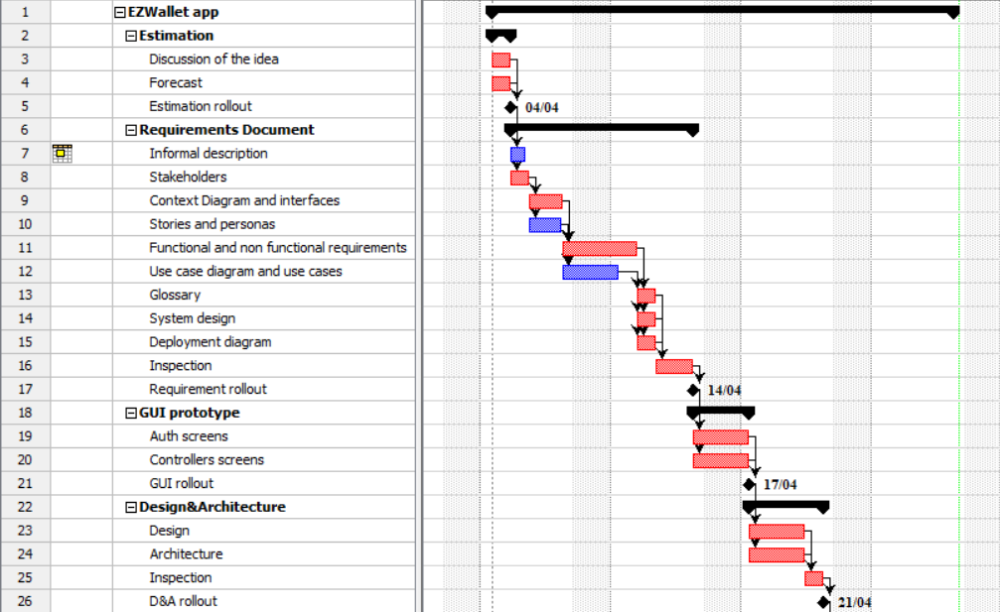
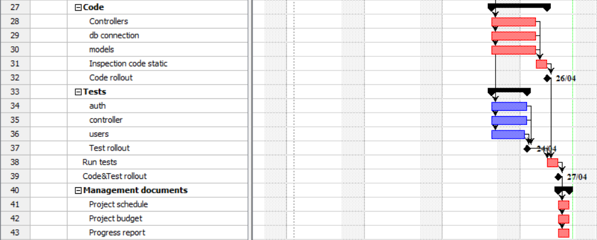

# Project Estimation - CURRENT
Date: 28/04/2023

Version: 1.0

# Estimation approach
Consider the EZWallet  project in CURRENT version (as received by the teachers), assume that you are going to develop the project INDEPENDENT of the deadlines of the course
# Estimate by size
### 
|             | Estimate                        |        Description          |    
| ----------- | ------------------------------- | --------------------------- | 
| NC =  Estimated number of classes to be developed   | 3 | The classes considered are: User, Category, Transaction  |          
|  A = Estimated average size per class, in LOC       | 300 LOC | 900/3 |
| S = Estimated size of project, in LOC (= NC * A) | 900 LOC | The size of the project is around 900LOC (main functionalities, classes, tests)|
| E = Estimated effort, in person hours (here use productivity 10 LOC per person hour)  | 90ph | E = size[LOC] / productivity[LOC/ph] | 
| C = Estimated cost, in euro (here use 1 person hour cost = 30 euro) | 2700€ | C = E[ph] * costPerHour[LOC/ph] |
| Estimated calendar time, in calendar weeks (Assume team of 4 people, 8 hours per day, 5 days per week ) | 0.6week -> 3days | week = 4 * 8 * 5 = 160ph   |        

# Estimate by product decomposition
### 
|         component name    | Estimated effort (person hours)   |             
| ----------- | ------------------------------- | 
|requirement document    | 38ph  |
| GUI prototype | 14ph |
|design document | 29ph |
| code | 16ph |
| unit tests | 10ph |
| api tests | 8ph |
| management documents  | 10ph |
| <b>TOT</b> | 125ph |

# Estimate by activity decomposition
### 
|         Activity name    | Estimated effort (person hours)   |             
| ----------- | ------------------------------- | 
| <b>Estimation</b> |  |
| Discussion of the idea | 1ph |
| Forecast | 1ph |
| <b>Requirements Document</b> |  |
| Informal description | 2ph |
| Stakeholders | 4ph |
| Context Diagram and interfaces | 2ph |
| Stories and personas | 4ph |
| Functional and non functional requirements | 3ph |
| Use case diagram and use cases | 8ph |
| Glossary | 1ph |
| System design | 1ph |
| Deployment diagram | 2ph |
| Inspection | 7ph |
| <b>GUI prototype</b> |  |
| Auth screens | 6ph |
| Controllers screens | 5ph |
| <b>Design&Architecture</b> |  |
| Design | 10ph |
| Architecture | 12ph |
| Inspection | 5ph |
| <b>Code</b> |  |
| Controllers | 6ph |
| db connection | 2ph |
| models | 5ph |
| Inspection code static | 3ph |
| <b>Tests</b> |  |
| auth | 5ph |
| controller | 5ph |
| users | 2ph |
| Run tests | 4ph |
| <b>Management documents</b> |  |
| Project schedule | 3ph |
| Project budget | 4ph |
| Progress report | 3ph |
| <b>TOT</b> | 116ph |

###

# Summary

The 3 approaches give to us different results. All three have consistency with each other, and the last two are very similar.
The estimation by size gives a result based only on the LOC written in the project and so is not always so accurate. The assumption about the productivity (10 LOC/h) is a parameter given to us that may not fit our group and for this reason could return a not precise result. Furthermore, an estimation based exclusevely on LOC can not properly take in account the work that can be done in parallel and the one that cannot.
The results from the estimations by product decompositon and by activity decomposition show an high level of consistency with each other. However, since is the group that made the estimations, the final values can be affected by unware biases of the team.

|             | Estimated effort                        |   Estimated duration |          
| ----------- | ------------------------------- | ---------------|
| estimate by size | 90ph | 15 days |
| estimate by product decomposition | 125ph | 21 days |
| estimate by activity decomposition | 116ph |  19 days |

*The estimation duration is not computed assuming a team of 4 people, 8 hours per day, 5 days per week, since not all the work can be done in parallel

