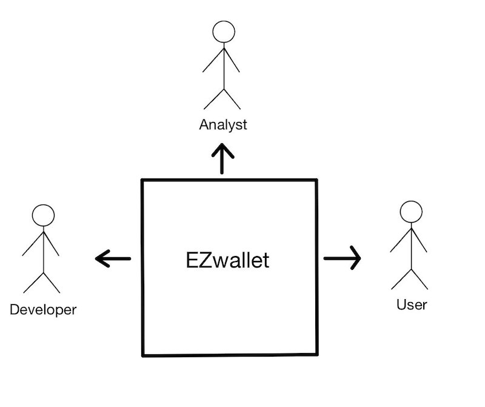
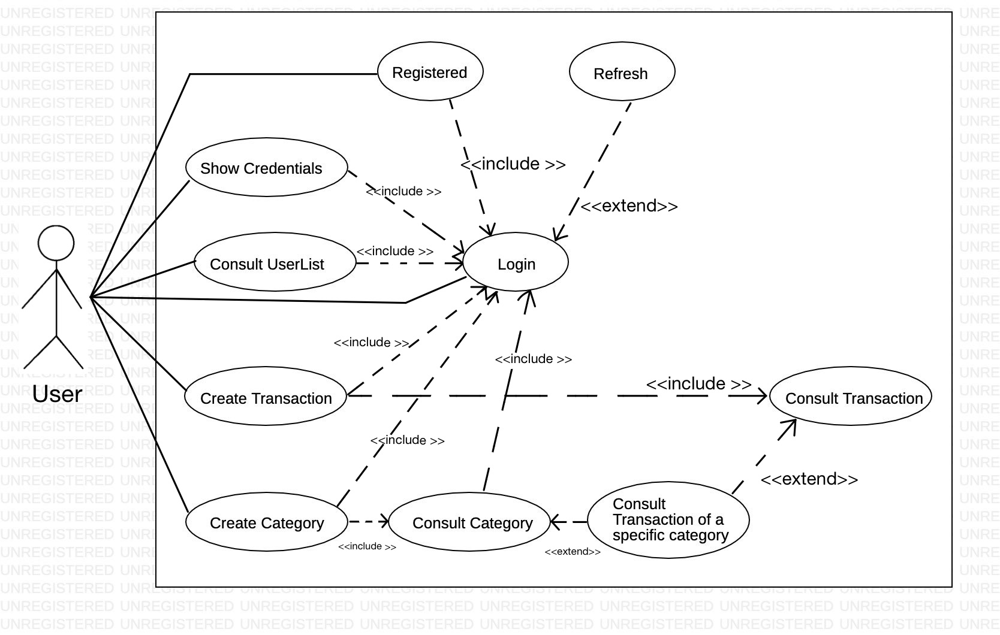
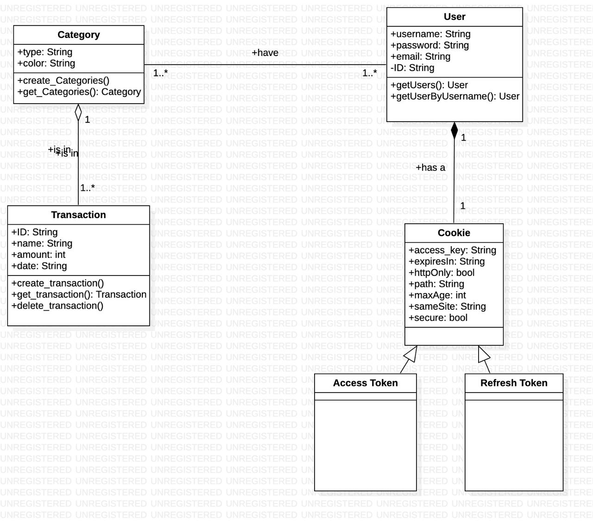
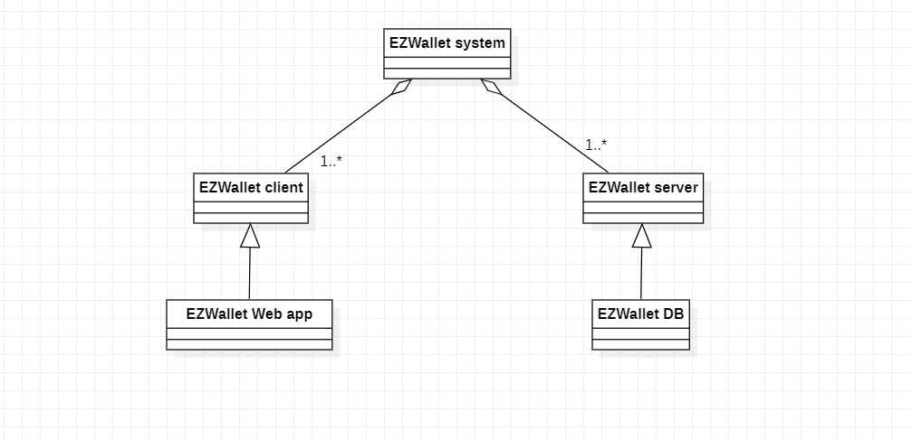
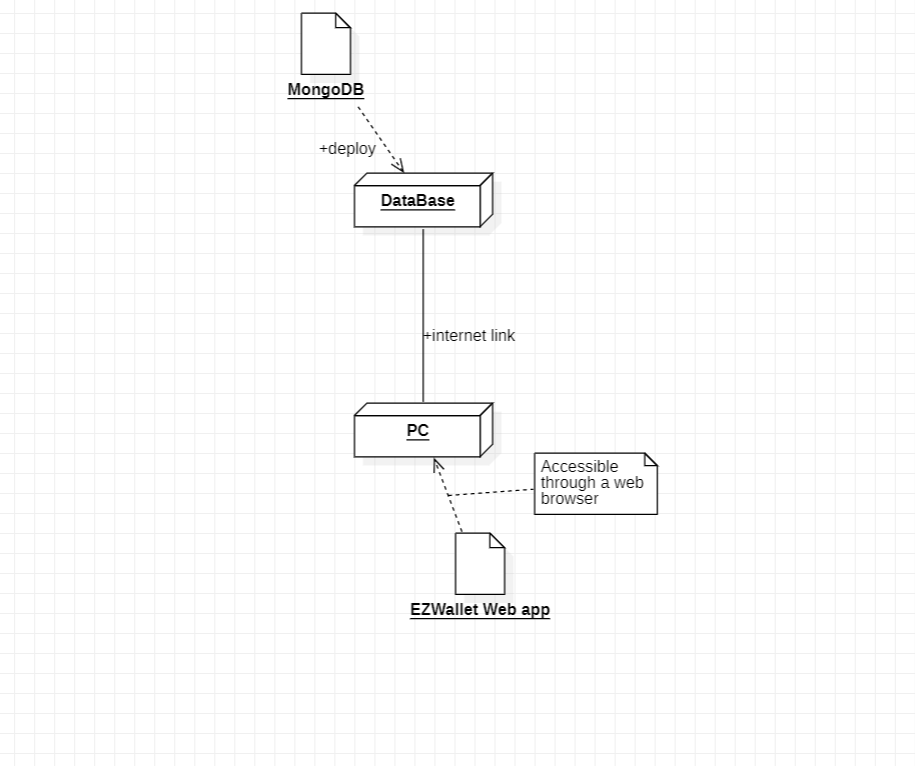

# Requirements Document - current EZWallet

Date: 25/04/2023

Version: V1 - description of EZWallet in CURRENT form (as received by teachers)

 
| Version number | Change |
| ----------------- |:-----------|
| 1.0 | | 

# Contents

- [Informal description](#informal-description)
	+ [General Information](#general-information)
	+ [Business Model](#business-model)
- [Stakeholders](#stakeholders)
- [Context Diagram and interfaces](#context-diagram-and-interfaces)
	+ [Context Diagram](#context-diagram)
	+ [Interfaces](#interfaces) 
	
- [Stories and personas](#stories-and-personas)
	+ [Personas](#personas)
	+ [Stories](#stories)
- [Functional and non functional requirements](#functional-and-non-functional-requirements)
	+ [Functional Requirements](#functional-requirements)
	+ [Non functional requirements](#non-functional-requirements)
- [Use case diagram and use cases](#use-case-diagram-and-use-cases)
	+ [Use case diagram](#use-case-diagram)
	+ [Use cases](#use-cases)
    	+ [Relevant scenarios](#relevant-scenarios)
- [Glossary](#glossary)
- [System design](#system-design)
- [Deployment diagram](#deployment-diagram)
- [Version V1 issues](#version-v1-issues)
	+ [User side issues](#user-side-issues )
	+ [Security issues](security-issues)

# Informal description

## General Information
EZWallet (read EaSy Wallet) is a software application designed to help individuals and families keep track of their expenses. Users can enter and categorize their expenses, allowing them to quickly see where their money is going. EZWallet is a powerful tool for those looking to take control of their finances and make informed decisions about their spending. EZWallet is designed to be a web-app (client server model) so every user can use this software on his device (smartphone or PC of any kind). 

## Business Model
We are a newborn start-up company with an horizontal organizational structure. Our team is made up of many developers and an analyst who is the coordinator of the project. Our app is free to download and we don't have any kind of profit. However we have to mantain a online Database in order to guarantee the service to our clients (but we are funded by the Politecnico di Torino).

# Stakeholders

| Stakeholder name  | Description | 
| ----------------- |:-----------:|
| User | Person who wants to keep track of his expenses  |  
| Developer | Person who develops the code of the software and manages the Database (Because there aren't any admin)|
| Analyst | Person who leads the developements of the project and coordinates the team of developers |
| Investor | Entity (like the Poltecnico di Torino) who funded the project  |

# Context Diagram and interfaces

## Context Diagram

## Interfaces

All the actor must have  a device with internet connection (smartphone or pc).
For the user, the app will be provided with a simple GUI for his operation.
The developer must also a set of tool for his work like an IDE or an AVD.
The Analyst must have a management software for coordinating the job.

| Actor | Logical Interface | Physical Interface  |
| ------------- |:-------------:| -----:|
|   User     | GUI (Login, manage transaction and categories)  | Smartphone or PC with internet connection |
| Developer | IDE, js API, AVD for testing | PC with internet connection|
| Analyst | Management Software | Smartphone or PC with internet connection|

# Stories and personas

## Personas
| Personas       |   |
| ------------- |:-------------:| 
|  Shopkeeper     | male middle age, medium income, low education. No significative life goals: he wants to preserve his grocery store, maintaining his activity. He needs a tool for keeping track the transaction with suppliers, not some sophisticated banking app. |
|uni_student | female, young, high income but offsite student, high education. She has to manage the money given by her family, and she wants to being able to track down every expenses. |
|  Freelancer | male, young, medium income, he has the habit of spending too much money in discretionary expenses - like videogames or expensive wine. He believes that if he put in writing all these expenses, he will be able to moderate himself and save enough money.  |

## Stories

|Story | |
| ------------- |:-------------:| 
| Shopkeeper: Working day| Working day: he meets supplier. He carries a load of vegetables. He unloads in the cold room, and he pays his price. He pays cash and proceeds to write that expense in the app: he creates a new transaction: "Herbs" "26/04/2023" "50€" in the "Vegetables" vategory.|
| Shopkeeper: Working day| one of his favourite suppliers has ceased the activity. He has replaced him easily, but its supplies are slightly different. Therefore, he proceeds to add the category "Energy Drinks" (colour: electric blue) in the app.|
| uni_student: End of the months | her parents think that she party too much. She argues that she has moderated, and she mentions that all her expenses in clubbing sums up to less than 50€, providing the app as evidence.| 
| Freelancer: Weekend | He has the impression of having spent too much on fishing gears. He wants to check: he opens the app, search the category "Fishing" and open all transactions: he makes the calculation and sees that, in this mounth, he had spent 150€ on a new fishing pole and 50€ in baits. It's too much, he has to contain himself.|

# Functional and non functional requirements

## Functional Requirements

| ID        | Description  |
| ------------- |:-------------:| 
|  FR1     | <b>Manage users</b> |
|  FR1.1   | Create a new user account given username, email and password. To each user is assigned a unique id |
|  FR1.2   | Login, Logout |
|  FR1.3   | Show users |
|  FR1.3.1 | show all registered users |
|  FR1.3.2 | search user by name |
|  FR2     | <b>Manage accesses</b> |
|  FR2.1   | Keep the access token available for 1h |
|  FR2.2   | Keep the refresh token available for 7d |
|  FR3     | <b>Manage transactions</b> |
|  FR3.1   | Create a new transaction given name, type, amount and date |
|  FR3.2   | Delete an existing transaction |
|  FR3.3   | Show all transactions |
|  FR4     | <b>Manage categories</b> |
|  FR4.1   | Create a new category given type and colour |
|  FR4.2   | Show all categories |
|  FR5     | <b>Manage labels</b> |
|  FR5.1   | Show all labels |

## Non Functional Requirements

| ID        | Type | Description  | Refers to |
| ------------- |:-------------:| :-----:| -----:|
|  NFR1     | <b>Efficiency</b>  | Each function completes within 0.5 sec | - |
|  NFR2     | <b>Portability</b> | Executable on all browsers | - |
|  NFR3     | <b>Security</b> | Maintain the refresh token for maximum 10 days. Maintain the access token for maximum 7h | FR2.1, FR2.2 |
| NFR4 | <b>Correctness</b> | Each function works properly in 99 of cases | - | 

# Use case diagram and use cases

## Use case diagram

### Use case 1: Log in the app
| General Information       | Description |
| ------------- |:-------------:| 
|Level | User Goal|
|Scope | Web App|
|Intention in context| The user wants to access his account|
| Minimum Guarantees| The user cannot access his account if he enters the wrong credentials|
| Success Guarantees| The user accesses his account if and only if he enters the right credentials|
|Primary actor |User |
|Support actors | - |
|  Precondition     | User hasn't logged in the app  |
|  Post condition     | User has logged in the app |
|  Trigger     | - |

##### 1: Main Success scenario 

| Main |  |
| ------------- |:-------------:| 
|  Precondition     | User hasn't logged in the app |
|  Post condition     | User has logged in the app |
| Step#        | Description  |
|  1     | The user opens the app |  
|  2     | The app displays a "email" and "password" form and a "create a new account" button on the bottom |
|  3  | The user inserts a value for the "email" and "password" forms each |
| 4 | The app checkss the correctness of inserted credentials| 
| 5 | The user can now access his profile|

##### 1: Extensions

| Step |  |
| ------------- |:-------------:| 
|  3a     | if the user has logged in the previous seven (7) days: the app saves his values for "email" and "password" |  
|  4a     | if the user inserts the wrong credentials: the app doesn't give access to his profile and throws an error message |
|  4b  | if the user doesn't have an account: the app doesn't give access to any profile and throws an error message |

### Use case 2: Register on the app
| General Information       | Description |
| ------------- |:-------------:| 
|Level | User Goal|
|Scope | Web App|
|Intention in context| The user wants to create a new account|
| Minimum Guarantees| -|
| Success Guarantees| The system creates a new account with the given data|
|Primary actor |User |
|Support actors | - |
|  Precondition     | here isn't an account associated with the given email  |
|  Post condition     | A valid account on the app associated with the given email is created |
|  Trigger     | - |

##### 2: Main Success scenario 

| Main |  |
| ------------- |:-------------:| 
|  Precondition     | There isn't an account associated with the given email |
|  Post condition     | A valid account on the app associated with the given email is created |
| Step#        | Description  |
|  1     | The user opens the app |  
|  2     | The app displays a "email" and "password" form and a "create a new account" button on the bottom |
|  3  | The user presses the "create a new account" button on the bottom |
| 4 | The app opens a form with "email", "username", "password" fields| 
| 5 | The user inserts a value for each field|
|6 |  The app creates a new valid account| 
| 7|The user now can insert the credentials to log in the app | 

##### 2: Extensions

| Step |  |
| ------------- |:-------------:| 
|  6a     | if the inserted "email" is already in the database: the app doesn't perform the operation and throws an error message |  
|  6b     | if any of the inserted values is already invalid: the app doesn't perform the operation and throws an error message |

### Use case 3: Refresh
| General Information       | Description |
| ------------- |:-------------:| 
|Level | User Goal|
|Scope | Web App|
|Intention in context| The user re-establishes a valid session|
| Minimum Guarantees| -|
| Success Guarantees| The user can perform operations|
|Primary actor |User |
|Support actors | - |
|  Precondition     | Previous session has expired; User has logged in (see UC 01) |
|  Post condition     | User is now in a valid session|
|  Trigger     | The current session has expired |

##### 3: Main Success scenario 

| Main |  |
| ------------- |:-------------:| 
|  Precondition     | Previous session has expired; User has logged in (see UC 01) |
|  Post condition     | User is now in a valid session |
| Step#        | Description  |
|  1     | An error message with a "login" button will pop up |  
|  2     | The user presses the "login" button |
|  3  | The user is now in the login page and he must insert his credentials to regain access |

##### 3: Extensions

| Step |  |
| ------------- |:-------------:| 
|  3a     | see UC01 |  

## Use Case 4
| Use Case 4     	| Log out |
| ------------- |:-------------:|
| Level | User Goal	|
| Scope | Web App	|
| Intention in context	| The user wants to close the current session	|
| Minimum Guarantees	| -	|	
| Success Guarantees	| The user accesses his account if and only if he enters the right credentials	|
| Primary actor 	| User	|
| Support actors	| -	|
| Pre condition 	| User has logged in (see UC 01) |
| Post condition	| Current section is closed |
| Trigger   	 	| - 	|

##### Main Success scenarios: 
##### Login with username and password: 
|Step | |
| ------------- |:-------------:|
|  1     | The user presses the "profile" button on the right |  
|  2     | The app opens a drop down menu|
|  3  | The user selects "Log out" |
| 4 	| A confirmation request message with a "log out" and a "return" buttons pops up|
| 5 	| The user presses the "log out" button	 |
| 6 	| The current session is closed and he must log in to regain access to the account (see UC 01) |

##### Extensions
|Estensions | |
| ------------- |:-------------:|
| 4a    | if the user has logged in the previous seven (7) days: the app saves his values for "email" and "password" | 
| 4a 	| if the authorization expires: the app doesn't perform the operation and throws an error message |

### Use case 5: Show account credentials
| General Information       | Description |
| ------------- |:-------------:| 
|Level | User Goal|
|Scope | Web App|
|Intention in context| The user wants to consult the credentials of his account |
| Minimum Guarantees| The user cannot access the credentials of another user|
| Success Guarantees| The system retrieves and shows all the credentials of the current user|
|Primary actor |User |
|Support actors | - |
|  Precondition     | User has a valid account; User has logged in (see UC 01) |
|  Post condition     | User has access to the credentials of his account |
|  Trigger     | - |

##### 5: Main Success scenario 

| Main |  |
| ------------- |:-------------:| 
|  Precondition     | User has a valid account; User has logged in (see UC 01) |
|  Post condition     | User has access to the credentials of his account |
| Step#        | Description  |
|  1     | The user presses the "profile" button on the right |  
|  2     | The app opens a drop down menu|
|  3  | The user selects "Profile information" |
| 4 | The app retrieves the information and displays on the screen a "email", "username" and "password" form| 

##### 5: Extensions

| Step |  |
| ------------- |:-------------:| 
|  2a     | if the authorization expires: the app doesn't perform the operation and throws an error message (see UC 03) |  
|  4a     | if the authorization expires: the app doesn't perform the operation and throws an error message (see UC 03) |
| 4b | The user can press the "eye" button on the right of the "password" form to see his password in plain text|

### Use case 6: Create new category
| General Information       | Description |
| ------------- |:-------------:| 
|Level | User Goal|
|Scope | Web App|
|Intention in context| The user wants to create a new category of transactions|
| Minimum Guarantees| The category values are correct|
| Success Guarantees| The system saves the new category|
|Primary actor |User |
|Support actors | - |
|  Precondition     | The category of user interest isn't present on the system; User has logged in (see UC 01)  |
|  Post condition     | The new category is saved in the system |
|  Trigger     | - |

##### 6: Main Success scenario 

| Main |  |
| ------------- |:-------------:| 
|  Precondition     | The category of user interest isn't present on the system; User has logged in (see UC 01)|
|  Post condition     | The new category is saved in the system |
| Step#        | Description  |
|  1     | The user presses the menu button on the left |  
|  2     | The app opens a side menu |
|  3  | The user selects "Categories" |
| 4 | The app retrieves the information and displays on the screen the list of all the categories, each with and a "triangle" button, and a "plus" button on the bottom| 
| 5 | The user presses the "plus" button on the bottom|
|6 |  The app displays a "Name" and "Colour" form| 
| 7|The user sets a value for "Name" | 
| 8| The user sets a value for "Colour", choosing among the given set of colours|
| 9| The system will save the new category|

##### 6: Extensions

| Step |  |
| ------------- |:-------------:| 
|  2a     | if the authorization expires: the app doesn't perform the operation and throws an error message (see UC 03) |  
|  4a    | if the authorization expires: the app doesn't perform the operation and throws an error message (see UC 03) |
| 4b | if the user hasn't inserted any transaction: the app will print nothing | 
| 5a| if the authorization expires: the app doesn't perform the operation and throws an error message (see UC 03)|
| 9a|if the authorization expires: the app doesn't perform the operation and throws an error message (see UC 03) |
| 9b|if the user hasn't inserted a value for "Name": the app doesn't perform the operation and throws an error message |
| 9c| if the user hasn't inserted a value for "Colour": the app doesn't perform the operation and throws an error message|   

### Use case 7: Consult Categories
| General Information       | Description |
| ------------- |:-------------:| 
|Level | User Goal|
|Scope | Web App|
|Intention in context| The user wants to consult the existing categories|
| Minimum Guarantees| -|
| Success Guarantees| The system retrieves all the categories|
|Primary actor |User |
|Support actors | - |
|  Precondition     | User wants to see all the categories; User has logged in (see UC 01)  |
|  Post condition     | User can consult the list of all categories|
|  Trigger     | - |

##### 7: Main Success scenario 

| Main |  |
| ------------- |:-------------:| 
|  Precondition     | User wants to see all the categories; User has logged in (see UC 01) |
|  Post condition     | User can consult the list of all categories |
| Step#        | Description  |
|  1     | The user presses the menu button on the left |  
|  2     | The app opens a side menu |
|  3  | The user selects "Categories"|
| 4 | The app retrieves the information and displays on the screen the list of all the categories, each with and a "triangle" button, and a "plus" button on the bottom| 

##### 7: Extensions

| Step |  |
| ------------- |:-------------:| 
|  2a     | if the authorization expires: the app doesn't perform the operation and throws an error message (see UC 03) |  
|  4a     | if the authorization expires: the app doesn't perform the operation and throws an error message (see UC 03) |
| 4b | if the user hasn't inserted any transaction: the app will print nothing |

### Use case 8: Create new transaction
| General Information       | Description |
| ------------- |:-------------:| 
|Level | User Goal|
|Scope | Web App|
|Intention in context| The user wants to create a new transaction|
| Minimum Guarantees| -|
| Success Guarantees| The system saves the new transaction |
|Primary actor |User |
|Support actors | - |
|  Precondition     | User wants to insert a new transaction; User has logged in (see UC 01)  |
|  Post condition     | The new transaction is saved in the system |
|  Trigger     | - |

##### 8: Main Success scenario 

| Main |  |
| ------------- |:-------------:| 
|  Precondition     | User wants to insert a new transaction; User has logged in (see UC 01) |
|  Post condition     | The new transaction is saved in the system |
| Step#        | Description  |
|  1     | The user presses the menu button on the left |  
|  2     | The app opens a side menu |
|  3  | The user selects "Transactions"|
| 4 | The app retrieves the information and displays on the screen all the transactions  and a "plus" button on the bottom| 
| 5 | The user presses the "plus" button on the bottom|
|6 |  The app displays a "Name", "Type", "Amount" and "Date" form| 
| 7|The user sets a value for "Name"| 
| 8 |The user sets a value for "Type", choosing among the existing categories, shown in a drop down menu |
| 9| The user sets a value for "Amount"|
|10| The user sets a value for "Date"|
|11 |The system will save the new transaction |

##### 8: Extensions

| Step |  |
| ------------- |:-------------:| 
|  2a     |if the authorization expires: the app doesn't perform the operation and throws an error message (see UC 03) |  
|  4a     |if the authorization expires: the app doesn't perform the operation and throws an error message (see UC 03)|
|4b | if the user hasn't inserted any transaction: the app displays nothing|
|6a |if the authorization expires: the app doesn't perform the operation and throws an error message (see UC 03) |
| 11a| if the authorization expires: the app doesn't perform the operation and throws an error message (see UC 03)| 
|11b | if the user hasn't inserted a value for "Name": the app doesn't perform the operation and throws an error message|
|11c |if the user hasn't inserted a value for "Amount": the app doesn't perform the operation and throws an error message |
|11d|if the user hasn't inserted a value for "Date": the app doesn't perform the operation and throws an error message |
|11e| if the user hasn't inserted a value for "Type": the app doesn't perform the operation and throws an error message|

### Use case 9: Consult Transactions
| General Information       | Description |
| ------------- |:-------------:| 
|Level | User Goal|
|Scope | Web App|
|Intention in context| The user wants to consult the existing transactions|
| Minimum Guarantees| -|
| Success Guarantees| he system retrieves all the transactions|
|Primary actor |User |
|Support actors | - |
|  Precondition     | User wants to see all transactions; User has logged in (see UC 01) |
|  Post condition     | User can consult the list of all transactions |
|  Trigger     | - |

##### 9: Main Success scenario 

| Main |  |
| ------------- |:-------------:| 
|  Precondition     | User wants to see all transactions; User has logged in (see UC 01)|
|  Post condition     | User can consult the list of all transactions|
| Step#        | Description  |
|  1     | The user presses the menu button on the left |  
|  2     | The app opens a side menu |
|  3  | The user selects "Transactions" |
| 4 | The app retrieves the information and displays on the screen all the transactions  and a "plus" button on the bottom| 

##### 9: Extensions

| Step |  |
| ------------- |:-------------:| 
|  2a     |if the authorization expires: the app doesn't perform the operation and throws an error message (see UC 03) |  
|  4a     | if the authorization expires: the app doesn't perform the operation and throws an error message (see UC 03)|
|4b | if the user hasn't inserted any transaction: the app displays nothing|

### Use case 10: Delete Transactions
| General Information       | Description |
| ------------- |:-------------:| 
|Level | User Goal|
|Scope | Web App|
|Intention in context| The user wants to consult the existing transactions|
| Minimum Guarantees	| The app is in a valid state |	
| Success Guarantees	| The app deletes the chosen transaction |
| Primary actor 	| User	 |
| Support actors	| -	 |
| Trigger   	 	| - 	|

##### 10: Main Success scenario 

| Main |  |
| ------------- |:-------------:| 
|Pre condition 	| User has saved at least one transaction; User wants to cancel one specific transaction; User has logged in (see UC 01) |
| Post condition	| The specific transaction is not present anymore in the app	|
| Step#        | Description  |
|  1     | The user presses the menu button on the left |  
|  2     | The app opens a side menu |
|  3 	 | The user selects "Transactions" |
|  4	 | The app retrieves the information and displays on the screen all the transactions  and a "plus" button on the bottom| 
|  5	 | The user presses the "bin" button on the transaction of his interest | 
|  6 	 | A confirmation request message with a "delete" and a "return" buttons pops up|
|  7 	 | The user presses the "delete" button	 |
|  8 	 | The app deletes the chosen transaction |

##### 10: Extensions

| Step |  |
| ------------- |:-------------:| 
|  2a   |if the authorization expires: the app doesn't perform the operation and throws an error message (see UC 03) |  
|  4a   | if the authorization expires: the app doesn't perform the operation and throws an error message (see UC 03)|
|  4b 	| if the user hasn't inserted any transaction: the app displays nothing|
|  6a   | if the authorization expires: the app doesn't perform the operation and throws an error message (see UC 03)|
|  8a   | if the authorization expires: the app doesn't perform the operation and throws an error message (see UC 03)|

### Use case 11: Consult the transactions of a specific category
| General Information       | Description |
| ------------- |:-------------:| 
|Level | User Goal|
|Scope | Web App|
|Intention in context| The user wants to consult all the transactions belonging to a specific category|
| Minimum Guarantees| -|
| Success Guarantees| The system retrieves all the transactions of a specific category|
|Primary actor |User |
|Support actors | - |
|  Precondition     |User wants to see all the transaction of a specific category; User has logged in (see UC 01)  |
|  Post condition     | User can consult all the transaction of a specific category |
|  Trigger     | - |

##### 11: Main Success scenario 

| Main |  |
| ------------- |:-------------:| 
|  Precondition     | User wants to see all the transaction of a specific category; User has logged in (see UC 01) |
|  Post condition     | User can consult all the transaction of a specific category|
| Step#        | Description  |
|  1     | The user presses the menu button on the left |  
|  2     | The app opens a side menu |
|  3  | The user selects "Categories" |
| 4 | The app retrieves the information and displays on the screen the list of all the categories, each with and a "triangle" button, and a "plus" button on the bottom| 
| 5 | The user presses the "triangle" button on the category of his interest|
|6 |  The app retrieves the information and will print on screen the list of all the transactions of the selected category| 

##### 11: Extensions

| Step |  |
| ------------- |:-------------:| 
| 2a|if the authorization expires: the app doesn't perform the operation and throws an error message (see UC 03) |
| 4a| if the authorization expires: the app doesn't perform the operation and throws an error message (see UC 03)|
|  6a     | if the authorization expires: the app doesn't perform the operation and throws an error message (see UC 03)|  
|  6b     | if the user hasn't inserted any transaction in the selected category: the app displays nothing |
|6c |the user can open multiple categories at the same time | 

### Use case 12: Consult Users List
| General Information       | Description |
| ------------- |:-------------:| 
|Level | User Goal|
|Scope | Web App|
|Intention in context| The user wants to consult the list of all existing users|
| Minimum Guarantees| -|
| Success Guarantees|The system retrieves a list of all the saved users|
|Primary actor |User |
|Support actors | - |
|  Precondition     | User wants to see the list of all of existing users; User has logged in (see UC 01)  |
|  Post condition     | User can consult the list of all of existing users |
|  Trigger     | - |

##### 12: Main Success scenario 

| Main |  |
| ------------- |:-------------:| 
|  Precondition     | User wants to see the list of all of existing users; User has logged in (see UC 01) |
|  Post condition     | User can consult the list of all of existing users |
| Step#        | Description  |
|  1     |The user presses the menu button on the left |  
|  2     | The app opens a side|
|  3  | The user selects "Users List" |
| 4 | The app retrieves the information and displays on screen the list of all the existing users and associated credentials| 

##### 12: Extensions

| Step |  |
| ------------- |:-------------:| 
|  2a     |if the authorization expires: the app doesn't perform the operation and throws an error message (see UC 03) |  
| 4a|if the authorization expires: the app doesn't perform the operation and throws an error message (see UC 03) |
|  4b     |if the authorization expires: the app doesn't perform the operation and throws an error message (see UC 03) |

# Glossary

We as team decided that the Label is not a class since it is an aggragation of items of other existing classes (Category + Transaction).

# System Design

The system is composed mainly by the client and the backend. In this version, V1, the software given to us describe a web client and a online DB.

# Deployment Diagram 

The client web app is available through a web browser since its source code is written in javascript. So any device (e.g. PC, IoS device, Android device...) that can install a web browser can use the app through the browser. The client is connected to the DB (MongoDB) through an internet connection. We supposed that the app is available for a moltitude of users and the data are stored in a DB hosted by the company.

# Version V1 issues

## User side issues  

- Categories and transactions are common to all the users 
- It is possible to assign a transaction to a category that does not exist
- It is possible to create more than one category with the same type. It is ambiguous for the user

## Security issues

- The refresh token and the access token are not tied to the user
	- Both the tokens are generated to the user but the checks do not perform a real control
	- POC (Proof of concepts)
		- 1
			- auth.js lines: 78, 79 -> the operation cookie.refreshToken only retrieve the cookie sent by the user but do not check it against user.refreshToken which is the actual refresh token of the user
			- Request a new token through the endpoint api/refresh setting manually a fake cookie (e.g. refreshToken=foo)
			- The endpoint answer with "User not found" and not with "Unauthorized"
		- 2
			- Request the categories through the endpoint api/getCategorie setting manually fake cookie (e.g. accessToken=foo)
			- The endpoint answer with the list of the categories in the DB and not with "Unauthorized"
		- 3
			- The user is logged in and has a valid access token (AT1)
			- The user request a new access token (AT2) through the endpoint api/refresh
			- Now the user can use either AT1 or AT2 to operate inside the app
			
- The logout does not work properly
	- During the logout phase (auth.js line: 128) only the refresh token is set to null, while the access token still valid
	- POC
		- The user is logged in and has a valid access token (AT1)
		- The user perform the logout
		- The user set manually the cookie AT1 in his browser and can still operate inside the web app

