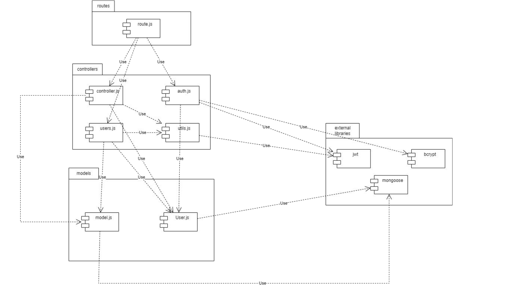
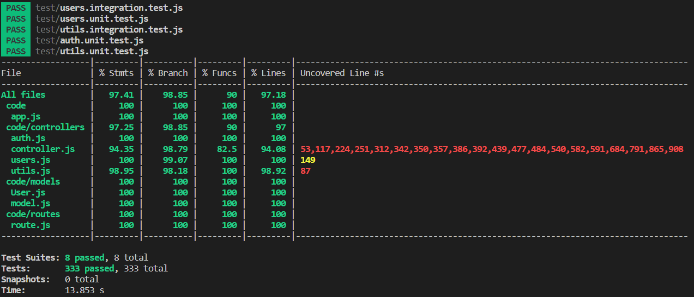

# Test Report

<The goal of this document is to explain how the application was tested, detailing how the test cases were defined and what they cover>

# Contents

- [Dependency graph](#dependency-graph)

- [Integration approach](#integration-approach)

- [Tests](#tests)

- [Coverage](#Coverage)


# Dependency graph 


     
# Integration approach
    
The testing phase was composed by 4 main parts:
- At the beginning we divided the requirements among team members and coded the functions. Subsequently, each member tested his functions through Postman, performing API tests on his functions to understand if the code worked correctly under standard conditions.
- Then we assigned the functions, previously assigned to one member, to another member of the group. As a first step, everyone statically inspected the code to understand its functionality and detect any flaws.
- After the inspection we coded the unit tests. For each function we created a driver test function and for the tested functions having calls to external functions we substitued them with stubs.
- In the end we coded the integration test.

So We used a mixed approach for testing. In the unit tests we verified the correct working of each function. Then with the integration tests we verified the beahavior of the external calls.

Example (each capital letter is a function, |\/ are calls):
```
         A
        / \
        B  C
        |
        D
```
unit test: tested independently A, B, C, D

integration test: called A and so testing the behavior A, B, C, D


# Tests

| Test case name | Object(s) tested | Test level | Technique used |
|--|--|--|--|
|`auth.js`||||
|`register`||||
|Returns a 400 error if the request body does not contain username|register|unit white box|statement coverage|
|Returns a 400 error if the request body does not contain email|register|unit white box|statement coverage|
|Returns a 400 error if the request body does not contain password|register|unit white box|statement coverage|
|Returns a 400 error if the username is an empty string|register|unit white box|statement coverage|
|Returns a 400 error if the email is an empty string|register|unit white box|statement coverage|
|Returns a 400 error if the password is an empty string|register|unit white box|statement coverage|
|Returns a 400 error if the email in the request body is not in a valid email format|register|unit white box|statement coverage|
|Returns a 400 error if the email in the request body identifies an already existing user|register|unit white box|statement coverage|
|Returns a 400 error if the username in the request body identifies an already existing user|register|unit white box|statement coverage|
|Returns 200 successful insertion|register|unit white box|statement coverage|
|Returns 500 throw an error|register|unit white box|statement coverage|
|Returns a 400 error if the email in the request body identifies an already existing user|register|integration|mixed|
|Returns a 400 error if the username in the request body identifies an already existing user|register|integration|mixed|
|Returns 200 successful insertion|register|integration|mixed|
|`registerAdmin`||||
|Returns a 400 error if the request body does not contain username|registerAdmin|unit white box|statement coverage|
|Returns a 400 error if the request body does not contain email|registerAdmin|unit white box|statement coverage|
|Returns a 400 error if the request body does not contain password|registerAdmin|unit white box|statement coverage|
|Returns a 400 error if the username is an empty string|registerAdmin|unit white box|statement coverage|
|Returns a 400 error if the email is an empty string|registerAdmin|unit white box|statement coverage|
|Returns a 400 error if the password is an empty string|registerAdmin|unit white box|statement coverage|
|Returns a 400 error if the email in the request body is not in a valid email format|registerAdmin|unit white box|statement coverage|
|Returns a 400 error if the email in the request body identifies an already existing user|registerAdmin|unit white box|statement coverage|
|Returns a 400 error if the username in the request body identifies an already existing user|registerAdmin|unit white box|statement coverage|
|Returns 200 successful insertion|registerAdmin|unit white box|statement coverage|
|Returns 500 throw an error|registerAdmin|unit white box|statement coverage|
|Returns a 400 error if the email in the request body identifies an already existing user|registerAdmin|integration|mixed|
|Returns a 400 error if the username in the request body identifies an already existing user|registerAdmin|integration|mixed|
|Returns 200 successful insertion|registerAdmin|integration|mixed|
|`login`||||
|Returns a 400 error if the request body does not contain email|login|unit white box|statement coverage|
|Returns a 400 error if the request body does not contain password|login|unit white box|statement coverage|
|Returns a 400 error if the email is an empty string|login|unit white box|statement coverage|
|Returns a 400 error if the password is an empty string|login|unit white box|statement coverage|
|Returns a 400 error if the email in the request body is not in a valid email format|login|unit white box|statement coverage|
|Returns a 400 error if the email in the request body does not identify a user in the database|login|unit white box|statement coverage|
|Returns a 400 error if the supplied password does not match with the one in the database|login|unit white box|statement coverage|
|Returns 200 successful login|login|unit white box|statement coverage|
|Returns 500, throw an error|login|unit white box|statement coverage|
|Returns a 400 error if the email in the request body does not identify a user in the database|login|integration|mixed|
|Returns a 400 error if the supplied password does not match with the one in the database|login|integration|mixed|
|Returns 200 successful login|login|integration|mixed|
|`logout`||||
|Returns a 400 error if the request does not have a refresh token in the cookies|logout|unit white box|statement coverage|
|Returns a 400 error if the refresh token in the request's cookies does not represent a user in the database|logout|unit white box|statement coverage|
|Returns a 401 error if the user has not simple authorization|logout|unit white box|statement coverage|
|Returns 200 logout successfully|logout|unit white box|statement coverage|
|Returns 500, throw an error|logout|unit white box|statement coverage|
|Returns a 400 error if the refresh token in the request's cookies does not represent a user in the database|logout|integration|mixed|
|Returns a 401 error if the user has not simple authorization|logout|integration|mixed|
|Returns 200, logout successfully|logout|integration|mixed|
|--|--|--|--|
|`controller.js`||||
|`createCategory`||||
| Should create a new category and return the saved data | createCategory |  unit white box/integration | statement |
| Should return a 401 error if called by a user who is not an Admin | createCategory |  unit white box/integration | statement |
| Should return a 400 error if the request body does not contain the color attribute | createCategory |  unit white box/integration | statement |
| Should return a 400 error if the request body does not contain the type attribute | createCategory |  unit white box/integration | statement |
| Should return a 400 error if the color attribute is an empty string | createCategory |  unit white box/integration | statement |
| Should return a 400 error if the type attribute is an empty string | createCategory |  unit white box/integration | statement |
| Should return a 400 error if the type of category passed in the request body represents an already existing category in the database | createCategory |  unit white box/integration | statement |
|`updateCategory`||||
| Should update an existing category | updateCategory |  unit white box/integration | statement |
| Should return a 401 error if called by a user who is not an Admin | updateCategory |  unit white box/integration | statement |
| Should return a 400 error if the request body does not contain the type attribute | updateCategory |  unit white box/integration | statement |
| Should return a 400 error if the request body does not contain the color attribute | updateCategory |  unit white box/integration | statement |
| Should return a 400 error if the type attribute is an empty string | updateCategory |  unit white box/integration | statement |
| Should return a 400 error if the color attribute is an empty string | updateCategory |  unit white box/integration | statement |
| Should return a 400 error if the type of category passed as a route parameter does not represent a category in the database | updateCategory |  unit white box/integration | statement |
| Should return a 400 error if the type of category passed in the request body as the new type represents an already existing category in the database | updateCategory |  unit white box/integration | statement |
|`deleteCategory`||||
| Should delete an existing category (case N > T) | deleteCategory |  unit white box/integration | statement |
| Should delete an existing category (case N === T, , all transaction type set to the oldest category) | deleteCategory |  unit white box/integration | statement |
| Should return a 400 error if the request body does not contain all the necessary attributes | deleteCategory |  unit white box/integration | statement |
| Should return a 400 error if called when there is only one category in the database | deleteCategory | unit white box/integration | statement |
| Should return a 400 error if at least one of the types in the array is an empty string | deleteCategory |  unit white box/integration | statement |
| Should return a 400 error if at least one of the types in the array does not represent a category in the database | deleteCategory |  unit white box/integration | statement |
| Should return a 401 error if called by a user who is not an Admin | deleteCategory |  unit white box/integration | statement |
|`getCategories`||||
| Should return all categories | getCategories |  unit white box/integration | statement |
| Should return a 401 error if accessed without authorization | getCategories |  unit white box/integration | statement |
|`createTransaction`||||
|Should create a new transaction and return the saved data|createTransaction|unit white box| 		statement coverage |
|Should return a 400 error if the username attribute is an empty string|createTransaction|unit white box| 		statement coverage|
|Should return a 400 error if the type attribute is an empty string|createTransaction|unit white box| 		statement coverage|
|Should return a 400 error if the amount attribute is an empty string|createTransaction|unit white box| statement coverage|
|Should return a 400 error if the username in the body is not equal to the one in the route|createTransaction|unit white box| 		statement coverage |
|Should return a 400 error if the username passed in the request body does not represent a user in the database|createTransaction|unit white box| 		statement coverage |
|Should return a 400 error if the amount passed in the request body cannot be parsed as a floating value|createTransaction|unit white box| statement coverage|
|Should return a 401 error if called by a user who is not an Admin|createTransaction|unit white box| 		statement coverage|
|Should return all the existing transactions|createTransaction|integration|		 mixed |
|Should create a new transaction(user)|createTransaction|integration|		 mixed |
|Should create a new transaction(admin)|createTransaction|integration|		 mixed |
|Should return a 400 error if the type attribute is an empty string|createTransaction|integration|		 mixed |
|Should return a 400 error if the type attribute is an empty string(admin)|createTransaction|integration|		 mixed |
|Should return a 400 error if the username attribute is an empty string|createTransaction|integration|		 mixed |
|Should return a 400 error if the username attribute is an empty string(admin)|createTransaction|integration|		 mixed |
|Should return a 400 error if the amount attribute is an empty string|createTransaction|integration|		 mixed |
|Should return a 400 error if the amount attribute is invalid|createTransaction|integration|		 mixed |
|Should return a 400 error if the amount attribute is an empty string(admin)|createTransaction|integration|		 mixed |
|Should return a 400 error if the amount attribute is invalid (admin)|createTransaction|integration|		 mixed |
|Should return a 400 error if the type attribute is undefined|createTransaction|integration|		 mixed |
|Should return a 400 error if the username attribute is undefined|createTransaction|integration|		 mixed |
|Should return a 400 error if the amount attribute is undefined|createTransaction|integration|		 mixed |
|Should return a 400 error if the type attribute is undefined|createTransaction|integration|		 mixed |
|Should return a 400 error if the username attribute is undefined|createTransaction|integration|		 mixed |
|Should return a 400 error if the amount attribute is undefined(admin)|createTransaction|integration|		 mixed |
|Should return a 400 error if the type of category passed in the request body does not represent a category in the database|createTransaction|integration|		 mixed |
|Should return a 400 error if the type of category passed in the request body does not represent a category in the database(admin)|createTransaction|integration|		 mixed |
|Should return a 400 error if the username passed in the request body is not equal to the one passed as a route parameter|createTransaction|integration|		 mixed |
|Should return a 400 error if the username passed passed as a route parameter does not represent a user in the database(admin)|createTransaction|integration|		 mixed |
|Should return a 400 error if the username passed in the request body does not represent a user in the database|createTransaction|integration|		 mixed |
|Should return a 400 error if the username passed in the request body does not represent a user in the database(admin)|createTransaction|integration|		 mixed |
|Should return a 400 error if the username passed passed as a route parameter does not represent a user in the database|createTransaction|integration|		 mixed |
|Should return a 400 error if the username passed passed as a route parameter does not represent a user in the database(admin)|createTransaction|integration|		 mixed |
|Should return a 401 error if called by an authenticated user who is not the same user as the one in the route parameter (authType = User)|createTransaction|integration|		 mixed |
|`getAllTransactions`||||
|Should return all the existing transactions|getAllTransactions|integration| 		mixed |
|Returns a 401 error if called by an authenticated user who is not an admin|getAllTransactions|integration| 		mixed |
|`getTransactionsByUser`||||
|Should return all the existing transactions(user - only his)|getTransactionsByUser|integration| mixed |
|Should return all the existing transactions with param(user - only his)|getTransactionsByUser|integration| mixed |
|Should return all the existing transactions(admin - only his)|getTransactionsByUser|integration| mixed |
|Should return a 400 error if the username passed as a route parameter does not represent a user in the database(user)|getTransactionsByUser|integration| mixed |
|Should return a 400 error if the username passed as a route parameter does not represent a user in the database(admin)|getTransactionsByUser|integration| mixed |
|Should return a 400 error if the username passed as a route parameter does not represent a user in the database(user)|getTransactionsByUser|integration| mixed |
|Should return a 401 error if if called by an authenticated user who is not the same user as the one in the route (authType = User) (user)|getTransactionsByUser|integration| mixed |
|Should return a 401 error if if called by by an authenticated user who is not an admin (authType = Admin) (admin)|getTransactionsByUser|integration| mixed |
|`getTransactionsByUserByCategory`||||
|Should return all the transactions of a specific category (user - only his)|getTransactionsByUserByCategory|integration| 			mixed |
|Should return all the transactions of a specific category (admin - any user)|getTransactionsByUserByCategory|integration| 			mixed |
|Should return a 400 error if the username passed as a route parameter does not represent a user in the database (user)|getTransactionsByUserByCategory|integration| 			mixed |
|Should return a 400 error if the username passed as a route parameter does not represent a user in the database (admin)|getTransactionsByUserByCategory|integration| 			mixed |
|Should return a 400 error if the category passed as a route parameter does not represent a category in the database (user)|getTransactionsByUserByCategory|integration| 			mixed |
|Should return a 400 error if the category passed as a route parameter does not represent a category in the database (admin)|getTransactionsByUserByCategory|integration| 			mixed |
|Should return a 401 error if called by an authenticated user who is not the same user as the one in the route (authType = User) (user)|getTransactionsByUserByCategory|integration| 			mixed |
|Should return a 401 error if called by an authenticated user who is not an admin (authType = Admin) (authType = User) (user)|getTransactionsByUserByCategory|integration| 			mixed |
|`getTransactionsByGroup`||||
|group -> transactions (user - only his group)|getTransactionsByGroup|integration|			mixed |
|should return a 400 error if the group name passed as a route parameter does not represent a group in the database(user)|getTransactionsByGroup|integration|			mixed |
|get transactions by group (admin)|getTransactionsByGroup|integration|			mixed |
|should return a 400 error if the group name passed as a route parameter does not represent a group in the database(admin)|getTransactionsByGroup|integration|			mixed |
|should return a 401 error if called by an authenticated user who is not part of the group (user)|getTransactionsByGroup|integration|			mixed |
|should return a 401 error if called by an authenticated user who is not an admin (admin)|getTransactionsByGroup|integration|			mixed |
|`getTransactionsByGroupByCategory`||||
|Should return the transactions made by the group of the user, filtered by category (user - only his group)|getTransactionsByGroupByCategory|integration| 		mixed |
|Should return the transactions made by the group of the selected user, filtered by category (admin - any group|getTransactionsByGroupByCategory|integration| 		mixed |
|Should return a 400 error if the group name passed as a route parameter does not represent a group in the database (user - only his group)|getTransactionsByGroupByCategory|integration| 		mixed |
|Should return a 400 error if the group name passed as a route parameter does not represent a group in the database (admin - any group)|getTransactionsByGroupByCategory|integration| 		mixed |
|Should return a 400 error if the category passed as a route parameter does not represent a category in the database (user - only his group)|getTransactionsByGroupByCategory|integration| 		mixed |
|Should return a 400 error if the category passed as a route parameter does not represent a category in the database (admin - any group)|getTransactionsByGroupByCategory|integration| 		mixed |
|Should return a 401 error if called by an authenticated user who is not part of the group (authType = Group) (user - only his group)|getTransactionsByGroupByCategory|integration| 		mixed |
|Should return a 401 error if called by an authenticated user who is not an admin (authType = Admin) (admin - any group)|getTransactionsByGroupByCategory|integration| 		mixed |
|`deleteTransaction`||||
|should return a 400 error if _id in the request body is undefined|deleteTransaction|unit white box|		statement coverage |
|should return a 400 error if _id in the request body is an empty string|deleteTransaction|unit white box|		 statement coverage|
|should return a 400 error if the username in the route parameter does not represent a user in the database|deleteTransaction|unit white box|		 statement coverage |
|should return a 400 error if the _id in the request body does not represent a transaction in the database|deleteTransaction|unit white box|		statement coverage |
|should return a 400 error if the _id in the request body represents a transaction made by a different user than the one in the route|deleteTransaction|unit white box|		 statement coverage|
|should find the right transaction and delete it (User)|deleteTransaction|unit white box|		statement coverage |
|Should delete an existing transaction, given id (user)|deleteTransaction|integration| 		mixed |
|Should delete an existing transaction, given id (admin)|deleteTransaction|integration| 		mixed |
|Should return 400 error if the request body does not contain all the necessary attributes (user)|deleteTransaction|integration| 		mixed |
|Should return 400 error if the request body does not contain all the necessary attributes (Admin)|deleteTransaction|integration| 		mixed |
|Should return 400 error if the `_id` in the request body is an empty string(user)|deleteTransaction|integration| 		mixed |
|Should return 400 error if the `_id` in the request body is an empty string, given id (admin)|deleteTransaction|integration| 		mixed |
|Should return 400 error if the username passed as a route parameter does not represent a user in the database(user)|deleteTransaction|integration| 		mixed |
|Should return 400 error if the username passed as a route parameter does not represent a user in the database(admin)|deleteTransaction|integration| 		mixed |
|Should return 400 error if the `_id` in the request body does not represent a transaction in the database(user)|deleteTransaction|integration| 		mixed |
|Should return 400 error if the `_id` in the request body does not represent a transaction in the database(admin)|deleteTransaction|integration| 		mixed |
|Should return 400 error if the `_id` in the request body represents a transaction made by a different user than the one in the route(user)|deleteTransaction|integration| 		mixed |
|Should return 400 error if the `_id` in the request body represents a transaction made by a different user than the one in the route(admin)|deleteTransaction|integration| 		mixed |
|Should return a 401 error if called by an authenticated user who is not the same user as the one in the route (user)|deleteTransaction|integration| 		mixed |
|`deleteTransactions`||||
|should find and delete transactions in the database based on _ids|deleteTransactions|unit white box| 	statement coverage |
|should return a 400 error if an _id in the request body is empty|deleteTransactions|unit white box| 	statement coverage |
|should return a 400 error if an _id in the request body does not represent a transaction in the database	|deleteTransactions|unit white box| 	statement coverage |
|Should return a 401 error if called by a user who is not an Admin|deleteTransactions|unit white box| 		statement coverage|
|Should delete multiple transaction, given id (admin only)|deleteTransaction|integration|		 mixed |
|Should return a 400 error if the request body does not contain all the necessary attributes (admin only)|deleteTransactions|integration|		 mixed |
|Should return a 400 error if at least one of the ids in the array is an empty string (admin only)|deleteTransactions|integration|		 mixed |
|Should return a 400 error if at least one of the does not represent a transaction in the database|deleteTransactions|integration|		 mixed |
|Should return a 401 error delete if called by an authenticated user who is not an admin|deleteTransactions|integration|		 mixed |
|--|--|--|--|
|`users.js`||||
|`getUsers`||||
|Returns a 401 error if called by an authenticated user who is not an admin|getUsers|unit white box|statement coverage|
|Returns 200, empty array|getUsers|unit white box|statement coverage|
|Returns 200, array with users|getUsers|unit white box|statement coverage|
|Returns 500, throw an error|getUsers|unit white box|statement coverage|
|Returns a 401 error if called by an authenticated user who is not an admin|getUsers|integration|mixed|
|Returns 200, empty array|getUsers|integration|mixed|
|Returns 200, array with users|getUsers|integration|mixed|
|`getUser`||||
|ReturnsReturns a 401 error if called by an authenticated user who is neither the same user as the one in the route parameter (authType = User) nor an admin (authType = Admin)|getUsers|unit white box|statement coverage|
|Auth as User, Returns a 400 error if the username passed as the route parameter does not represent a user in the database|getUsers|unit white box|statement coverage|
|Auth as Admin, Returns a 400 error if the username passed as the route parameter does not represent a user in the database|getUsers|unit white box|statement coverage|
|Auth as User, Returns 200, user find successfully|getUsers|unit white box|statement coverage|
|Auth as Admin, Returns 200, user find successfully|getUsers|unit white box|statement coverage|
|Auth as Admin, Return 500, throw an error|getUsers|unit white box|statement coverage|
|Auth as User, Returns a 400 error if the username passed as the route parameter does not represent a user in the database|getUsers|integration|mixed|
|Auth as Admin, Returns a 400 error if the username passed as the route parameter does not represent a user in the database|getUsers|integration|mixed|
|Auth as User, Returns 200, user find successfully|getUsers|integration|mixed|
|Auth as Admin, Returns 200, user find successfully|getUsers|integration|mixed|
|`createGroup`||||
|Returns a 400 error if the request body does not contain all the necessary attributes|createGroup|integration|statement coverage|
|Returns a 400 error if the request body does not contain the name of the group|createGroup|unit white box|statement coverage|
|Returns a 400 error if the group name passed in the request body is an empty string|createGroup|unit white box|statement coverage|
|Returns a 400 error if the request body does not contain the emails|createGroup|unit white box|statement coverage|
|Returns a 400 error if the group name passed in the request body represents an already existing group in the database|createGroup|integration|statement coverage|
|Returns a 400 error if all the provided emails represent users that are already in a group or do not exist in the database|createGroup|integration|statement coverage|
|Returns a 400 error if the user who calls the API is already in a group|createGroup|unit white box / integration|statement coverage|
|Returns a 400 error if at least one of the member emails is not in a valid email format|createGroup|integration|statement coverage|
|Returns a 400 error if at least one of the member emails is an empty string|createGroup|integration|statement coverage|
|Returns a 401 error if called by a user who is not authenticated (authType = Simple)|createGroup|integration|statement coverage|
|Return 200 for correct behaviour|createGroup|unit white box / integration|statement coverage |
|Returns 500, throw an error|createGroup|unit white box|statement coverage |
|`getGroups`||||
|Returns a 401 error if called by an authenticated user who is not an admin (authType = Admin)|getGroups|unit white box / integration| statement/decision/path/ |
|Return 200 for correct behaviour|getGroups|integration|statement coverage |
|Returns 500, throw an error|getGroups|unit white box|statement coverage |
|`getGroup`||||
|Returns a 400 error if the group name passed as a route parameter does not represent a group in the database|getGroup|unit white box / integration| statement coverage|
|Returns a 401 error if called by an authenticated user who is neither part of the group (authType = Group) nor an admin (authType = Admin)|getGroup|unit white box / integration| statement coverage |
|Return 200 for correct behaviour|getGroup|unit white box / integration|statement coverage|
|Returns 500, throw an error|getGroup|unit white box|statement coverage |
|`addToGroup`||||
|Returns a 400 error if the request body does not contain the emails of the group|addToGroup|unit white box|statement coverage |
|Returns a 400 error if the request body does not contain the name of the group|addToGroup|unit white box|statement coverage |
|Returns a 400 error if the request body does not contain all the necessary attributes|addToGroup|integration|statement coverage|
|Returns a 400 error if the group name passed as a route parameter does not represent a group in the database|addToGroup|unit white box / integration|statement coverage|
|Returns a 400 error if all the provided emails represent users that are already in a group or do not exist in the database|addToGroup|integration|statement coverage|
|Returns a 400 error if at least one of the member emails is not in a valid email format|addToGroup|integration|statement coverage|
|Returns a 400 error if at least one of the member emails is an empty string|addToGroup|integration|statement coverage|
|Returns a 401 error if called by an authenticated user who is not part of the group (authType = Group) if the route is api/groups/:name/add|addToGroup|integration|statement coverage|
|Returns a 401 error if called by an authenticated user who is not an admin (authType = Admin) if the route is api/groups/:name/insert|addToGroup|integration|statement coverage|
|Return 200 for correct behaviour|addToGroup|integration|statement coverage|
|Returns 500, throw an error|addToGroup|unit white box|statement coverage |
|`removeFromGroup`||||
|Returns a 400 error if the request body does not contain the emails of the group|removeFromGroup|unit white box|statement coverage |
|Returns a 400 error if the request body does not contain the name of the group|removeFromGroup|unit white box|statement coverage |
|Returns a 400 error if the request body does not contain all the necessary attributes|removeFromGroup|integration| statement coverage |
|Returns a 400 error if the group name passed as a route parameter does not represent a group in the database|removeFromGroup|integration| statement coverage |
|Returns a 400 error if all the provided emails represent users that do not belong to the group or do not exist in the database|removeFromGroup|integration| statement coverage |
|Returns a 400 error if at least one of the emails is not in a valid email formats|removeFromGroup|unit white box / integration| statement coverage |
|Returns a 400 error if at least one of the emails is an empty string|removeFromGroup|unit white box / integration| statement coverage |
|Returns a 400 error if the group contains only one member before deleting any user|removeFromGroup|unit white box / integration| statement coverage |
|Returns a 401 error if called by an authenticated user who is not part of the group (authType = Group) if the route is api/groups/:name/remove|removeFromGroup|unit white box / integration| statement coverage |
|Returns a 401 error if called by an authenticated user who is not an admin (authType = Admin) if the route is api/groups/:name/pull|removeFromGroup|integration| statement coverage |
|Return 200 for correct behaviour|removeFromGroup|integration| statement coverage |
|Returns 500, throw an error|removeFromGroup|unit white box|statement coverage |
|`deleteUser`||||
|Returns a 400 error if the request body does not contain all the necessary attributes|deleteUser|unit white box|statement coverage|
|Returns a 400 error if the email passed in the request body is an empty string|deleteUser|unit white box|statement coverage|
|Returns a 400 error if the email passed in the request body is not in correct email format|deleteUser|unit white box|statement coverage|
|Returns a 401 error if called by an authenticated user who is not an admin (authType = Admin)|deleteUser|unit white box|statement coverage|
|Returns a 400 error if the email passed in the request body does not represent a user in the database|deleteUser|unit white box|statement coverage|
|Returns a 400 error if the email passed in the request body represents an admin|deleteUser|unit white box|statement coverage|
|Returns 500, throw an error|deleteUser|unit white box|statement coverage|
|Returns a 401 error if called by an authenticated user who is not an admin (authType = Admin)|deleteUser|unit white box|mixed|
|Returns a 400 error if the email passed in the request body does not represent a user in the database|deleteUser|unit white box|mixed|
|Returns a 400 error if the email passed in the request body represents an admin|deleteUser|unit white box|mixed|
|Returns 200, user not in a group, no transactions|deleteUser|unit white box|mixed|
|Returns 200, user in group, user is the only member in the group, no transactions|deleteUser|unit white box|mixed|
|Returns 200, user in group, user is NOT the only member in the group, no transactions|deleteUser|unit white box|mixed|
|`deleteGroup`||||
|Returns a 400 error if the request body does not contain all the necessary attributes|deleteGroup|integration| statement coverage |
|Returns a 400 error if the name passed in the request body is an empty string|deleteGroup|unit white box / integration| statement coverage |
|Returns a 401 error if called by an authenticated user who is not an admin (authType = Admin)|deleteGroup|unit white box / integration| statement coverage |
|Return 200 for correct behaviour|deleteGroup|unit white box / integration| statement coverage |
|Returns 500, throw an error|deleteGroup|unit white box|statement coverage |
|--|--|--|--|
|`utils.js`||||
|`handleDateFilterParams`||||
|Returns the value of date that depends on the query parameters of dates|handleDateFilterParams|unit white box| statement coverage |
|Throws an error if an invalid format is given in the query|unit white box| statement coverage |
|Returns the correct value of date  that depends on the query parameters |handleDateFilterParams|unit white box| statement coverage |
|Throws an error if an incorrect date format is detected|handleDateFilterParams|unit white box| statement coverage |
|Throws an error if date and from are present in the query (invalid combination)|handleDateFilterParams|unit white box| statement coverage |
|Throws an error if date and upTo are present in the query (invalid combination)|unit white box| statement coverage |
|should throw an error for error in query parameters|handleDateFilterParams|integration| statement coverage |
|Case in which from and upTo are undefined|handleDateFilterParams|integration| statement coverage |
|Case in which date is undefined from and upTo are both not undefined|handleDateFilterParams|integration| statement coverage |
|Case in which date and from are undefined but upTo is defined|handleDateFilterParams|integration| statement coverage |
|Case in which date and upTo are undefined but from is defined|handleDateFilterParams|integration| statement coverage |
|Case in which all params are undefined|handleDateFilterParams|integration| statement coverage |
|`verifyAuth`||||
|Returns a 400 error if the cookies doesnt have the access token|verifyAuth|unit white box| statement coverage|
|Returns a 400 error if the cookies doesnt have the refresh token|verifyAuth|unit white box| statement coverage|
|Returns authorized false if access token is missing information|verifyAuth|unit white box| statement coverage|
|Returns authorized false if Mismatched users|verifyAuth|unit white box| statement coverage|
|correct response, case User|verifyAuth|unit white box| statement coverage|
|correct response, case Admin|verifyAuth|unit white box| statement coverage|
|correct response, case Group|verifyAuth|unit white box| statement coverage|
|AccessToken expired and correct refresh token|verifyAuth|unit white box| statement coverage|
|should return unauthorized object when accessToken is missing|verifyAuth|integration| statement coverage|
|should return unauthorized object when refreshToken is missing|verifyAuth|integration| statement coverage|
|should return unauthorized object when accessToken is missing information|verifyAuth|integration| statement coverage|
|should return unauthorized object when refreshToken is missing information|verifyAuth|integration| statement coverage|
|should return unauthorized object when tokens have mismatched users|verifyAuth|integration| statement coverage|
|should return authorized if the authType is Simple|verifyAuth|integration| statement coverage|
|should return Unauthorized if the authType is User and the are mismatched username|verifyAuth|integration| statement coverage|
|should return authorized if the authType is User and the token is correct|verifyAuth|integration| statement coverage|
|should return Unauthorized if the authType is Admin and the role is Regular|verifyAuth|integration| statement coverage|
|should return authorized if the authType is Admin and the token is correct|verifyAuth|integration| statement coverage|
|should return Unauthorized if the authType is Group and the access token doesnt belong to the info email|verifyAuth|integration| statement coverage|
|should return authorized if the authType is Group and the token is correct|verifyAuth|integration| statement coverage|
|should return Unauthorized if the authType is unknown|verifyAuth|integrationx| statement coverage|
|if a token expires, try to regenerate a new token and if the refresh token is also expires retun Unauthorized|verifyAuth|integration| statement coverage|
|if a token expires, regenerate a new token from the refresh token and continue the check|verifyAuth|integration| statement coverage|
|if a generic error raises while regerating the refresh token, return that error|verifyAuth|integration| statement coverage|
|if a generic error is raised, return that error|verifyAuth|integration| statement coverage|
|`handleAmountFilterParams`||||
|The value of amount depends on the query parameters both Max and Min |handleAmountFilterParams|unit white box| statement coverage|
|Throws an error if the value of any of the two query parameters is not a numerical value. Max && Min |handleAmountFilterParams|unit white box| statement coverage|
|The value of amount depends on the query parameters of max |handleAmountFilterParams|unit white box| statement coverage|
|The value of amount depends on the query parameters of min |handleAmountFilterParams|unit white box| statement coverage|
|should throw an error for Non numerical values|handleAmountFilterParams|integration| statement coverage|
|Case in which both min and max are defined|handleAmountFilterParams|integration| statement coverage|
|Case in which max is defined and min is undefined|handleAmountFilterParams|integration| statement coverage|
|Case in which min is defined and max is undefined|handleAmountFilterParams|integration| statement coverage|
|Case in which both min and max are defined|handleAmountFilterParams|integration| statement coverage|


# Coverage


## Coverage of FR

<Report in the following table the coverage of  functional requirements (from official requirements) >

| Functional Requirements covered |   Test(s) | 
| ------------------------------- | ----------- | 
|  FR1    | Manage users |
| FR11 | register |
||Returns a 400 error if the request body does not contain username|
||Returns a 400 error if the request body does not contain email|
||Returns a 400 error if the request body does not contain password|
||Returns a 400 error if the username is an empty string|
||Returns a 400 error if the email is an empty string|
||Returns a 400 error if the password is an empty string|
||Returns a 400 error if the email in the request body is not in a valid email format|
||Returns a 400 error if the email in the request body identifies an already existing user|
||Returns a 400 error if the username in the request body identifies an already existing user|
||Returns 200 successful insertion|
| FR12| login |
||Returns a 400 error if the request body does not contain email|
||Returns a 400 error if the request body does not contain password|
||Returns a 400 error if the email is an empty string|
||Returns a 400 error if the password is an empty string|
||Returns a 400 error if the email in the request body is not in a valid email format|
||Returns a 400 error if the email in the request body does not identify a user in the database|
||Returns a 400 error if the supplied password does not match with the one in the database|
||Returns 200 successful login|
| FR13| logout |
||Returns a 400 error if the request does not have a refresh token in the cookies|
||Returns a 400 error if the refresh token in the request's cookies does not represent a user in the database|
||Returns a 401 error if the user has not simple authorization|
||Returns 200 logout successfully|
| FR14 | registerAdmin |
||Returns a 400 error if the request body does not contain username|
||Returns a 400 error if the request body does not contain email|
||Returns a 400 error if the request body does not contain password|
||Returns a 400 error if the username is an empty string|
||Returns a 400 error if the email is an empty string|
||Returns a 400 error if the password is an empty string|
||Returns a 400 error if the email in the request body is not in a valid email format|
||Returns a 400 error if the email in the request body identifies an already existing user|
||Returns a 400 error if the username in the request body identifies an already existing user|
||Returns 200 successful insertion|
| FR15 | getUsers |
||Returns a 401 error if called by an authenticated user who is not an admin|
||Returns 200, empty array|
||Returns 200, array with users|
| FR16 | getUser |
||ReturnsReturns a 401 error if called by an authenticated user who is neither the same user as the one in the route |parameter (authType = User) nor an admin (authType = Admin)|
||Auth as User, Returns a 400 error if the username passed as the route parameter does not represent a user in the database|
||Auth as Admin, Returns a 400 error if the username passed as the route parameter does not represent a user in the database|
||Auth as User, Returns 200, user find successfully|
||Auth as Admin, Returns 200, user find successfully|
| FR17 | deleteUser |
||Returns a 400 error if the request body does not contain all the necessary attributes|
||Returns a 400 error if the email passed in the request body is not in correct email|
||Returns a 400 error if the email passed in the request body does not represent a user in the database|
||Returns a 400 error if the email passed in the request body represents an admin|
||Returns a 401 error if called by an authenticated user who is not an admin (authType = Admin)|
||Returns 200, user not in a group, no transactions|
||Returns 200, user in group, user is the only member in the group, no transactions|
||Returns 200, user in group, user is NOT the only member in the group, no transactions|
|--|--|
| FR2 | Manage groups |
|||
| FR21 | createGroup |
||Returns a 400 error if the request body does not contain all the necessary attributes|
||Returns a 400 error if the group name passed in the request body is an empty string|
||Returns a 400 error if the group name passed in the request body represents an already existing group in the database|
||Returns a 400 error if all the provided emails represent users that are already in a group or do not exist in the database|
||Returns a 400 error if the user who calls the API is already in a group|
||Returns a 400 error if at least one of the member emails is not in a valid email format|
||Returns a 400 error if at least one of the member emails is an empty string|
||Returns a 401 error if called by a user who is not authenticated (authType = Simple)|
||Return 200 for correct behaviour|
| FR22| getGroups |
||Returns a 401 error if called by an authenticated user who is not an admin (authType = Admin)|
||Return 200 for correct behaviour|
| FR23| getGroup |
||Returns a 400 error if the group name passed as a route parameter does not represent a group in the database|
||Returns a 401 error if called by an authenticated user who is neither part of the group (authType = Group) nor an admin (authType = Admin)|
||Return 200 for correct behaviour|
| FR24| addToGroup |
||Returns a 400 error if the request body does not contain all the necessary attributes|
||Returns a 400 error if the group name passed as a route parameter does not represent a group in the database|
||Returns a 400 error if all the provided emails represent users that are already in a group or do not exist in the database|
||Returns a 400 error if at least one of the member emails is not in a valid email format|
||Returns a 400 error if at least one of the member emails is an empty string|
||Returns a 401 error if called by an authenticated user who is not part of the group (authType = Group) if the route is api/groups/:name/add|
||Returns a 401 error if called by an authenticated user who is not an admin (authType = Admin) if the route is api/groups/:name/insert|
||Return 200 for correct behaviour|
| FR26| removeFromGroup |
||Returns a 400 error if the request body does not contain all the necessary attributes|
||Returns a 400 error if the group name passed as a route parameter does not represent a group in the database|
||Returns a 400 error if all the provided emails represent users that are already in a group or do not exist in the database|
||Returns a 400 error if at least one of the member emails is not in a valid email format|
||Returns a 400 error if at least one of the member emails is an empty string|
||Returns a 400 error if the group contains only one member before deleting any user|
||Returns a 401 error if called by an authenticated user who is not part of the group (authType = Group) if the route is api/groups/:name/add|
||Returns a 401 error if called by an authenticated user who is not an admin (authType = Admin) if the route is api/groups/:name/insert|
||Return 200 for correct behaviour|
| FR28| deleteGroup |
||Returns a 400 error if the request body does not contain all the necessary attributes|
||Returns a 400 error if the group name passed as a route parameter does not represent a group in the database|
||Returns a 400 error if all the provided emails represent users that are already in a group or do not exist in the database|
||Returns a 401 error if called by an authenticated user who is not an admin (authType = Admin)|
||Return 200 for correct behaviour|
|--|--|
|  FR3   |  Manage  transactions|
|||
|FR31| createTransaction|
|	|Should create a new transaction and return the saved data	|
|	|Returns a 400 error if the request body does not contain all the necessary attributes	|
|	|Returns a 400 error if at least one of the parameters in the request body (username, amount, type) is an empty string	|
|	|Returns a 400 error if the type of category passed in the request body does not represent a category in the database	|
|	|Returns a 400 error if the username passed in the request body is not equal to the one passed as a route parameter	|
|	|Returns a 400 error if the username passed in the request body does not represent a user in the database	|
|	|Returns a 400 error if the username passed as a route parameter does not represent a user in the database	|
|	|Returns a 400 error if the amount passed in the request body cannot be parsed as a floating value	|
|	|Returns a 401 error if called by an authenticated user who is not the same user as the one in the route parameter (authType = User)	|
|FR32| getAllTransactions |
|	|Should return all the existing transactions	|
|	|Returns a 401 error if called by an authenticated user who is not an admin (authType = Admin)
| FR33| getTransactionsByUser  | 
|	| Should return all the existing transactions made by the user. Can be filtered by date and amount if the necessary query parameters are present  (authType = User)|
|	| Should return all the existing transactions made by the user  (authType = Admin)|	
|	| Returns a 400 error if the username passed as a route parameter does not represent a user in the database	|
|	| Returns a 401 error if called by an authenticated user who is not the same user as the one in the route (authType = User) if called by user route	|
|	| Returns a 401 error if called by an authenticated user who is not an admin (authType = Admin) if called by admin route	|
| FR34| getTransactionsByUserByCategory|
|	| Should return all the transactions of a specific category made by the user (authType = User)	|
|	| Should return all the transactions of a specific category made by any user (authType = Admin)	|
|	| Returns a 400 error if the username passed as a route parameter does not represent a user in the database	|
|	| Returns a 400 error if the category passed as a route parameter does not represent a category in the database	|
|	| Returns a 401 error if called by an authenticated user who is not the same user as the one in the route (authType = User) if called by user route	|
|	| Returns a 401 error if called by an authenticated user who is not an admin (authType = Admin)	if called by admin route|
| FR35| getTransactionsByGroup |
|	| Should return all the transactions made by the members of the group of the user (authType = User) 	|
|	| Should return all the transactions made by the members of any group (authType = Admin) 	|
|	| Returns a 400 error if the group name passed as a route parameter does not represent a group in the database	|
|	| Returns a 401 error if called by an authenticated user who is not part of the group (authType = Group) if called by user route	|
|	| Returns a 401 error if called by an authenticated user who is not an admin (authType = Admin)  if called by admin route	|
| FR36| getTransactionsByGroupByCategory |
|	| Should return the transactions made by the members of the group of the user, filtered by a given category  (authType = User) 	|
|	| Should return the transactions made by the members of any group, filtered by a given category  (authType = Admin) 		|
|	| Returns a 400 error if the group name passed as a route parameter does not represent a group in the database	|
|	| Returns a 400 error if the category passed as a route parameter does not represent a category in the database	|
|	| Returns a 401 error if called by an authenticated user who is not part of the group (authType = Group) if called by user route	|
|	| Returns a 401 error if called by an authenticated user who is not an admin (authType = Admin) if called by admin route	|
| FR37| deleteTransaction |
|	| Should delete an existing transaction made by the user, given id	(authType = User ) |
|	| Should delete an existing transaction made by any user, given id	(authType = Admin)  |
|	|Returns a 400 error if the request body does not contain all the necessary attributes |
|| Returns a 400 error if the `_id` in the request body is an empty string|
|| Returns a 400 error if the username passed as a route parameter does not represent a user in the database|
|| Returns a 400 error if the `_id` in the request body does not represent a transaction in the database|
|| Returns a 400 error if the `_id` in the request body represents a transaction made by a different user than the one in the route|
|| Returns a 401 error if called by an authenticated user who is not the same user as the one in the route (authType = User)|
| FR38| deleteTransactions |
|	|	|
|	| Should delete multiple transactions, given id	  (authType = Admin) |
|| Returns a 400 error if the request body does not contain all the necessary attributes|
|| Returns a 400 error if at least one of the ids in the array is an empty string|
|| Returns a 400 error if at least one of the ids in the array does not represent a transaction in the database|
|| Returns a 401 error if called by an authenticated user who is not an admin (authType = Admin)|
|--|--|
|  FR4  |  Manage categories |
| FR41| createCategory |
|| Should create a new category and return the saved data |
|| Should return a 401 error if called by a user who is not an Admin |
|| Should return a 400 error if the request body does not contain the color attribute |
|| Should return a 400 error if the request body does not contain the type attribute |
|| Should return a 400 error if the color attribute is an empty string |
|| Should return a 400 error if the type attribute is an empty string |
|| Should return a 400 error if the type of category passed in the request body represents an already existing category in the database |
| FR42| updateCategory |
|| Should update an existing category |
|| Should return a 401 error if called by a user who is not an Admin |
|| Should return a 400 error if the request body does not contain the type attribute |
|| Should return a 400 error if the request body does not contain the color attribute |
|| Should return a 400 error if the type attribute is an empty string |
|| Should return a 400 error if the color attribute is an empty string |
|| Should return a 400 error if the type of category passed as a route parameter does not represent a category in the database |
|| Should return a 400 error if the type of category passed in the request body as the new type represents an already existing category in the database |
| FR43| deleteCategory |
|| Should delete an existing category (case N > T) |
|| Should delete an existing category (case N === T, , all transaction type set to the oldest category) |
|| Should return a 400 error if the request body does not contain all the necessary attributes |
|| Should return a 400 error if called when there is only one category in the database |
|| Should return a 400 error if at least one of the types in the array is an empty string |
|| Should return a 400 error if at least one of the types in the array does not represent a category in the database |
|| Should return a 401 error if called by a user who is not an Admin |
| FR44 | getCategories |
|| Should return all categories |
|| Should return a 401 error if accessed without authorization |

## Coverage white box



We can notice that in the in the file controller.js the functions covered are only the 82%. This is because some Promises are treated with the blocks catch(), error() and so for these promises We did not test the error() block. This causes this not high percentage of functions tested.


