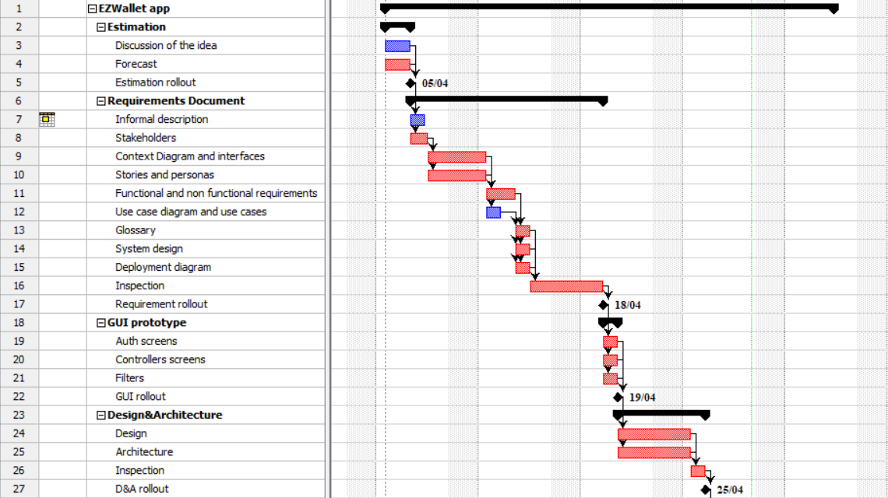
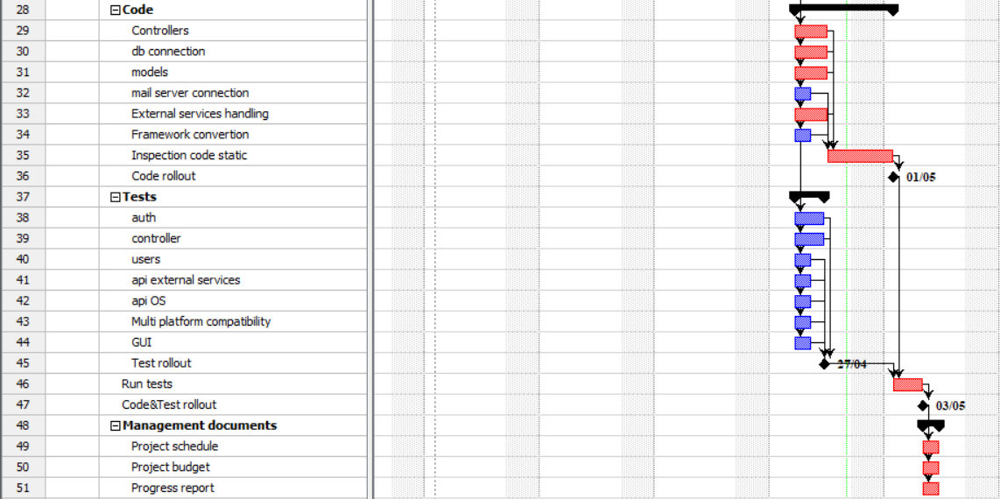

# Project Estimation - FUTURE
Date: 28/04/2023

Version: 2.0

# Estimation approach
Consider the EZWallet  project in FUTURE version (as proposed by the team), assume that you are going to develop the project INDEPENDENT of the deadlines of the course
# Estimate by size
### 
|             | Estimate                        |             
| ----------- | ------------------------------- |  
| NC =  Estimated number of classes to be developed   | 8 |             
|  A = Estimated average size per class, in LOC       | 250LOC | 
| S = Estimated size of project, in LOC (= NC * A) | 2000LOC |
| E = Estimated effort, in person hours (here use productivity 10 LOC per person hour)  | 200ph |   
| C = Estimated cost, in euro (here use 1 person hour cost = 30 euro) | 6000€ | 
| Estimated calendar time, in calendar weeks (Assume team of 4 people, 8 hours per day, 5 days per week ) | 1.3week -> 8 days |               

# Estimate by product decomposition
### 
|         component name    | Estimated effort (person hours)   |             
| ----------- | ------------------------------- | 
|requirement document    | 45ph |
| GUI prototype | 24ph |
|design document | 33ph |
|code | 35ph |
| unit tests | 20ph |
| api tests | 18ph |
| management documents  | 15ph |
| <b>TOT</b> | 190ph |

# Estimate by activity decomposition
### 
|         Activity name    | Estimated effort (person hours)   |             
| ----------- | ------------------------------- | 
| <b>Estimation</b> |  |
| Discussion of the idea | 4ph |
| Forecast | 2ph |
| <b>Requirements Document</b> |  |
| Informal description | 4ph |
| Stakeholders | 5ph |
| Context Diagram and interfaces | 4ph |
| Stories and personas | 6ph |
| Functional and non functional requirements | 6ph |
| Use case diagram and use cases | 12ph |
| Glossary | 3ph  |
| System design | 1ph |
| Deployment diagram | 3ph |
| Inspection | 12ph |
| <b>GUI prototype</b> |  |
| Auth screens | 8ph |
| Controllers screens | 7ph |
| Filters | 4ph |
| <b>Design&Architecture</b> |  |
| Design | 10ph |
| Architecture | 12ph |
| Inspection | 7ph |
| <b>Code</b> |  |
| Controllers | 8ph |
| db connection | 3ph |
| models | 6ph |
| mail server connection | 2ph |
| External services handling | 5ph |
| Framework convertion | 5ph  |
| Inspection code static | 7ph |
| <b>Tests</b> |  |
| auth | 7ph |
| controller | 6ph |
| users | 3ph |
| api external services | 4ph |
| api OS | 2ph |
| Multi platform compatibility | 5ph |
| GUI | 3ph |
| Run tests | 4ph |
| <b>Management documents</b> |  |
| Project schedule | 3ph |
| Project budget | 4ph |
| Progress report | 3ph |
| <b>TOT</b> | 187ph |
###

# Summary

All the 3 approaches give us results with a high degree of consistency.
Since in version 2 the size of the project is bigger than in version 1 (2 times the size) the estimation by size is also increased.
This time, the estimated effort by size is sligthly higher than the estimations by decomposition and by activity, likely because the work to compile the documents (Requirements document, management documents...) do not increase linearly as the code does. Anyway the decomposition estimation are always affected by the biases of the group and for this reaon are correlated between them.

|             | Estimated effort                        |   Estimated duration |          
| ----------- | ------------------------------- | ---------------|
| estimate by size | 200ph | 30 days |
| estimate by product decomposition | 190ph |  28 days |
| estimate by activity activity | 187ph | 28 days |

*The estimation duration is not computed assuming a team of 4 people, 8 hours per day, 5 days per week, since not all the work can be done in parallel

