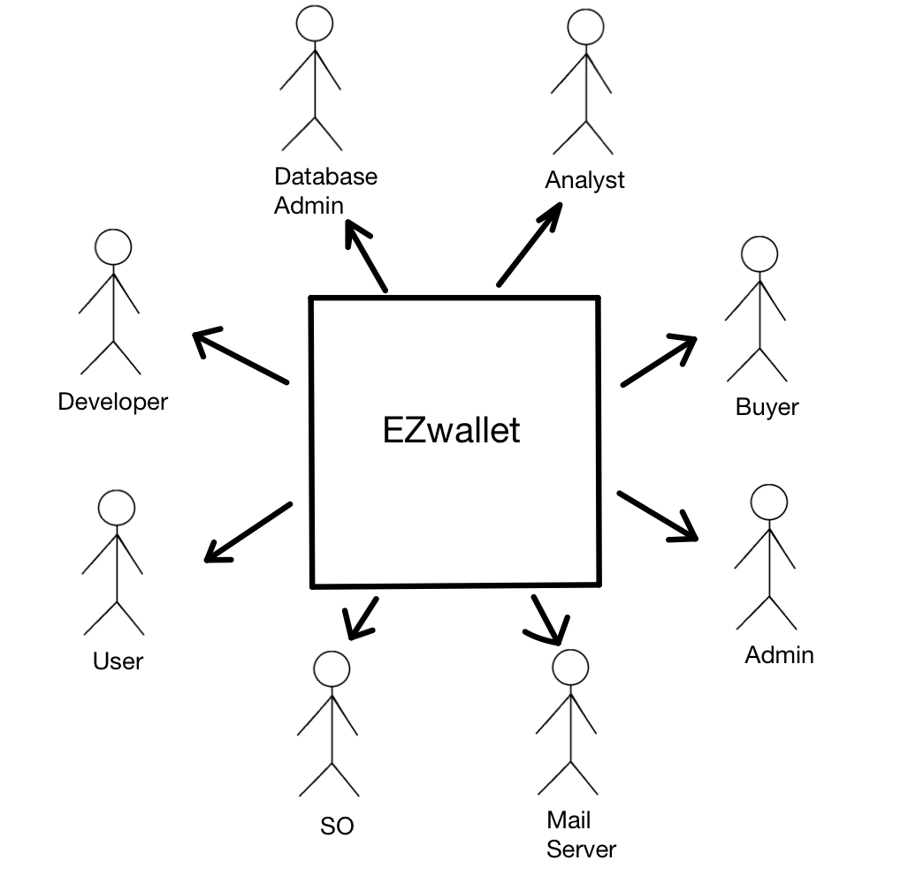
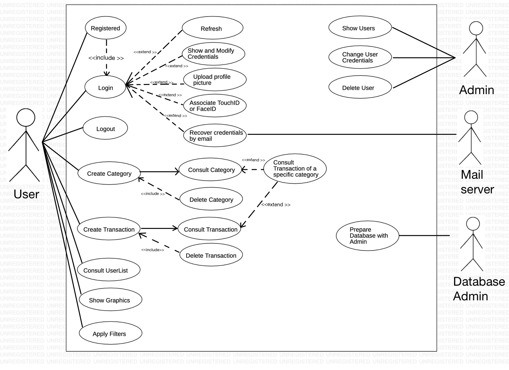
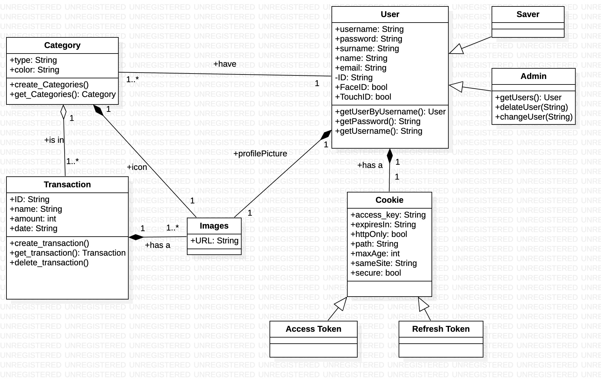
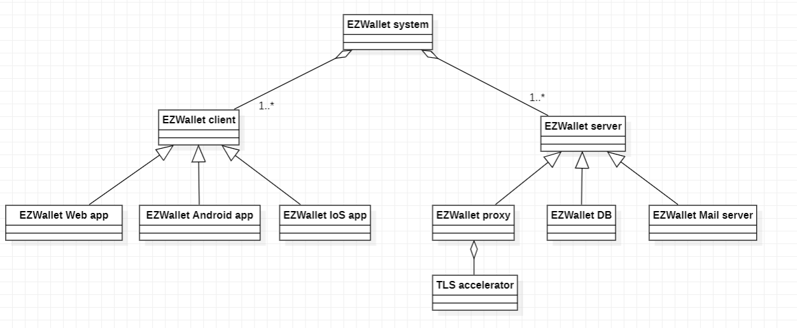
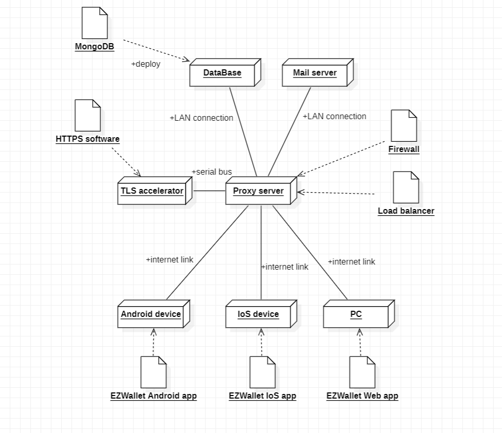

# Requirements Document - future EZWallet

Date:  28/04/2023

Version: V2 - description of EZWallet in FUTURE form (as proposed by the team)

 
| Version number | Change |
| ----------------- |:-----------|
| 2.0| | 

# Contents

- [Informal description](#informal-description)
- [Stakeholders](#stakeholders)
- [Context Diagram and interfaces](#context-diagram-and-interfaces)
	+ [Context Diagram](#context-diagram)
	+ [Interfaces](#interfaces) 
	
- [Stories and personas](#stories-and-personas)
- [Functional and non functional requirements](#functional-and-non-functional-requirements)
	+ [Functional Requirements](#functional-requirements)
	+ [Non functional requirements](#non-functional-requirements)
- [Use case diagram and use cases](#use-case-diagram-and-use-cases)
	+ [Use case diagram](#use-case-diagram)
	+ [Use cases](#use-cases)
    	+ [Relevant scenarios](#relevant-scenarios)
- [Glossary](#glossary)
- [System design](#system-design)
- [Deployment diagram](#deployment-diagram)

# Informal description

## General Information
EZWallet (read EaSy Wallet) is a software application designed to help individuals and families keep track of their expenses. Users can enter and categorize their expenses, allowing them to quickly see where their money is going. EZWallet is a powerful tool for those looking to take control of their finances and make informed decisions about their spending. EZWallet is designed to be a web-app (client server model) so every user can use this software on his device (smartphone or PC of any kind). 

## Business Model
We are a newborn start-up company with an horizontal organizational structure. Our team is made up of many developers and an analyst who is the coordinator of the project. Our app is free to download and we don't have any kind of profit. However we have to mantain a online Database in order to guarantee the service to our clients (but we are funded by the Politecnico di Torino).

# Stakeholders

| Stakeholder name  | Description | 
| ----------------- |:-----------:|
|   User    |        Person who wants to keep track of his expenses     | 
|Developer |Person who develops the code of the software and manages the Database (Because there aren't any admin) |
| Admin | Person who is responsible of proper  |
| Database Admin|  Person who is responsible for the proper functioning of the app |
| Analyst | Person who leads the developements of the project and coordinates the team of developers|
| Investor | Entity (like the Poltecnico di Torino) who funded the project|
| Operating System | OS of the device (need permission for TouchID or FaceID) |
|Mail Server | Service that is necessary to send email from the app to the user |

# Context Diagram and interfaces

## Context Diagram

## Interfaces

| Actor | Logical Interface | Physical Interface  |
| ------------- |:-------------:| -----:|
|   User     | GUI (Login, manage transaction and categories)  | Smartphone or PC with internet connection |
| Buyer | GUI (Login, manage transaction and categories) | Smartphone or PC with internet  connection|
| Admin | Dedicated GUI (Login with priority, manage users) | Smartphone or PC with internet connection|
| Database Admin | GUI, Database API & access | Smartphone or PC with internet connection|
| Developer | IDE, js API, AVD for testing | PC with internet connection|
| Analyst | - | Smartphone or PC with internet connection|
| Operating System| - |  API for TouchID or FaceID|
# Stories and personas

## Personas
| Personas       |   |
| ------------- |:-------------:| 
|  Shopkeeper     | male middle age, medium income, low education. No significative life goals: he wants to preserve his grocery store, maintaining his activity. He needs a tool for keeping track the transaction with suppliers, not some sophisticated banking app. |
|University student | female, young, high income but offsite student, high education. She has to manage the money given by her family, and she wants to being able to track down every expenses. |
|  Freelancer | male, young, medium income, he has the habit of spending too much money in discretionary expenses - like videogames or expensive wine. He believes that if he put in writing all these expenses, he will be able to moderate himself and save enough money.  |

## Stories

|Story | |
| ------------- |:-------------:| 
| Shopkeeper: Working day| Working day: he meets supplier. He carries a load of vegetables. He unloads in the cold room, and he pays his price. He pays cash and proceeds to write that expense in the app: he creates a new transaction: "Herbs" "26/04/2023" "50€" in the "Vegetables" vategory.|
| Shopkeeper: later in the day| he realized he miswrote the amount of that transaction. He opens the app and proceeds to replace "500€" with "50€"|
|Shopkeeper: Working day |one of his favourite suppliers has ceased the activity. He has replaced him easily, but its supplies are slightly different. Therefore, he proceeds to create a new category for the new supplier, so that the can |
|Shopkeeper: End of the month |he wants to be sure to have paid all his bills. He checks all the transaction of the last month related to his management fees to check if all his fees has been paid. He discovers that he forgot to pay the electricity bill, so he proceeds to pay it. |
| University student: End of the months | her parents think that she party too much. She argues that she has moderated, and she mentions that all her expenses in clubbing sums up to less than 50€, providing the app as evidence.| 
|University student: a day |she has the suspicion that her account was hacked, so he proceeds to change her password and email to be sure that the third party won't be able to enter in her profile. |
|University student: a day  |she is reviewing her managing of the finances and she proceeds to rationalize it. She splits the "home expenses" category, separating "Saving for rent" and "Saving for bills". She then proceeds to cancel the "medical expenses" category, because she never performed a transaction that fell in that category.  |
| Freelancer: Weekend | He has the impression of having spent too much on fishing gears. He wants to check: he opens the app, search the category "Fishing" and open all transactions: he makes the calculation and sees that, in this mounth, he had spent 150€ on a new fishing pole and 50€ in baits. It's too much, he has to contain himself.|
|Freelancer: Working day|he now is an employee in a big company, so he has to mantain a more professional public image. To avoid any possible troubles, he proceeds to change his old username on the app, "FunnyLittleGuy82" to "Eric Richardson" and replace his old profile picture, depicting him in the act of fishing a marlin, with a photo of him in a tan suit.|
|Freelancer: Working day |a company pays him 2000€ in two tranches of 1000€ each. He proceeds to create a transaction for the first tranche, and then updating it when the second part arrives, so that he has now one single entry of the right amount rather than two smaller ones.|

# Functional and non functional requirements

## Functional Requirements

| ID        | Description  |
| ------------- |:-------------:| 
| FR1     | <b>Manage users                                                                                                                                               |
| FR1.1   | _Simple user functionalities_ |
| FR1.1.1 | User can create a new user account given username, email, password, name, surname. To each user is assigned a unique id.                                                |
| FR1.1.2 | User can change his credential for his account.                                                                                                                   |
| FR1.1.3 | User can upload a profile picture.                                                                                                                                  |
| FR1.1.4 | User can recover credential from email, receving a recovery code.                                                                                                             |
| FR1.1.5 | User can access his account with FaceID.                                                                                                                         |
| FR1.2   | _Admin functionalities_                                                                                                                                                       |
| FR1.2.1 | Admic can consult the list of all the exising users.                                                                                                                           |
| FR1.2.2 | Admin's accounts are "hardcoded" in the db.                                                                                          |
| FR1.2.3 | Admin can change the credentials of a determinated user.                                                                                                           |
| FR1.2.4 | Admin can create or delete a user.                                                                                                            |
| FR1.3   | _General operations for both user and admin_                                                                                                                |
| FR1.3.1 | Login, logout.
| FR2     | <b>Manage accesses                                                                                                                                           |
| FR2.1   | Keep the access token available for 1h.                                                                                                                      |
| FR2.2   | Keep the refresh token available for 7d.                                                                                                                      |
| FR2.3   | Binding of the cookies with the user.                                                                                                                         |
| FR2.4   | Must control the access cookie for each endpoint.                                                                                                             |
| FR3     | <b>Manage transactions                                                                                                                                         |
| FR3.1   | User can create a new transaction given name, type, amount (it can be positive (income) or negative (outcome)) and date.                                                         |
| FR3.2 | Users can delete existing transactions. |
| FR3.3   | User can consult all their transactions..                                                                                                                     |
| FR3.4   | Show all transactions owned by the user.                                                                                                                      |
| FR3.5 | User can edit an existing transaction. |
| FR4     | <b>Manage categories                                                                                                                                       |
| FR4.1   | User can create a new category given type, colour and a symbol (optional).                                                                                                          |
| FR4.2   | User can consult all their categories                                                                                                                        |
| FR4.3 | User can edit an existing category. |
| FR5     | <b>Manage labels                                                                                                                                           |
| FR5.1   | Users can consult all their labels.                                                                                                                                             |
| FR5.2   | _Users can see cake graphics with all transactions divided by catagories._                                                                                              |
| FR5.2.1 | A cake graphic is realted to the incomes, the other to the outcomes.                                                      |
| FR6     | <b>Filters on transactions and labels                                                                                                           |
| FR6.1   | _Setting filters with the desired value ranges._                                                                                                                      |
| FR6.1.1 | A filter is related to the amount range, the other to the date range. |
| FR6.2   | The app will show only the transaction or label according to the filters.                                                                                                            |
## Non Functional Requirements

| ID        | Type | Description  | Refers to |
| ------------- |:-------------:| :-----:| -----:|
|  NFR1     | <b>Efficiency</b>  | Each function completes within 0.5 sec | - |
|  NFR2     | <b>Portability</b> | Executable on all browsers and natively in IoS and Android | - |
|  NFR3.1     | <b>Security</b> | Maintain the refresh token for maximum 10 days. Maintain the access token for maximum 7h | FR2.1, FR2.2 |
|  NFR3.2     | <b>Security</b> | The system should not show internal details of its architecture (screen internal servers) | - |
|  NFR3.3     | <b>Security</b> | All the connections from the proxy server to the clients should be secure (encrypted, authenticated) | - |
| NFR4 | <b>Correctness</b> | Each function works properly in 99% of cases | - | 
| NFR5 | <b>Reliability</b> | The system should not be down for more than 6h | - | 

# Use case diagram and use cases

## Use case diagram

### Use Cases
|List | |
| ------------- |:-------------:| 
| Use Case 1.1      	| Register on the app |
| Use Case 1.2      	| Log in the app (="Log in")|
| Use Case 1.3		| Consult account credentials (= go to "Profile Page") |
| Use Case 1.4		| Edit account credentials |
| Use Case 1.5		| Upload profile picture |
| Use Case 1.6		| Associate the profile with TouchID or FaceID | (work in progress)
| Use Case 1.7		| Recover credentials via email | (work in progress) |
| Use Case 1.8		| Refresh |
| Use Case 2.1		| Consult Categories (= go to "Category page") |
| Use Case 2.2		| Create new category |
| Use Case 3.1		| Consult Transactions (= go to "Transactions page") |
| Use Case 3.2		| Create new transaction |
| Use Case 3.3		| Delete an existing transaction |
| Use Case 4		| Consult the transactions of a specific category |
| Use Case 5.1		| Consult graphics about the composition of the transactions |
| Use Case 5.2		| Apply filters on transactions |
| Use Case 6.1		| Admin: Consult Users | 
| Use Case 6.2		| Admin: Change User Credentials |
| Use Case 6.3		| Admin: Delete User |

## Use Case 1.1
| Use Case 1.1      	| Register on the app |
| ------------- |:-------------:|
| Level | User Goal	|
| Scope | Web App	|
| Intention in context	| The user wants to create a new account	|
| Minimum Guarantees	| The user values are correct |							|	
| Success Guarantees	| The app creates a new account with the given data	|
| Primary actor 	| User	 |
| Support actors	| Mail Server |
| Pre condition 	| There isn't an account associated with the given email  	|
| Post condition	| A valid account on the app associated with the given email is created	|
| Trigger   	 	| - 	|

##### Main Success scenario 
|Step | |
| ------------- |:-------------:|
| 1	| The user opens the app |  
| 2     | The app displays a "email" and "password" form and a "create a new account", "forgot your password?", "login with FaceID" buttons on the bottom |
| 3	| The user presses the "create a new account" button on the bottom |
| 4	| The app opens a form with "name", "surname", "email", "username", "password" and "confirm password" fields | 
| 5 	| The user inserts a value for each field |
| 6 	| The app creates a new valid account | 
| 7	| The user now can insert the credentials to log in the app | 
| 8 	| The mail server sends an email, to the inserted email address, with a confirmation message | 

##### Extensions
|Estensions | |
| ------------- |:-------------:|
| 6a    | if the inserted "email" is already in the database: the app doesn't perform the operation and throws an error message |  
| 6b    | if any of the inserted values is invalid: the app doesn't perform the operation and throws an error message |
| 6c	| if the password in "confirm password" doesn't equal the password inserted in "password": the app doesn't perform the operation and throws an error message |	

## Use Case 1.2
| Use Case 1.2      	| Log in the app (="Log in")|
| ------------- |:-------------:|
| Level | User Goal	|
| Scope | Web App	|
| Intention in context	| The user wants to access his account 	|
| Minimum Guarantees	| The user cannot access his account if he enters the wrong credentials	|	
| Success Guarantees	| The user accesses his account if and only if he enters the right credentials	|
| Primary actor 	| User	 |
| Support actors	| -	 |
| Pre condition 	| User hasn't logged in the app  	|
| Post condition	| User has logged in the app	|
| Trigger   	 	| - 	|

### Main Success scenarios: 
##### Login with username and password: 
|Step | |
| ------------- |:-------------:|
| 1	| The user opens the app |  
| 2     | The app displays a "email" and "password" form and a "create a new account", "forgot you password?", "login with FaceID"  button on the bottom. This is known as "Log in page" |
| 3	| The user inserts a value for the "email" and "password" forms each |
| 4	| The app checks the correctness of inserted credentials | 
| 5 	| The user can now access his profile | 

##### Extensions
|Estensions | |
| ------------- |:-------------:|
| 3a    | if the user has logged in the previous seven (7) days: the app saves his values for "email" and "password" |  
| 4a    | if the user inserts the wrong credentials: the app doesn't give access to his profile and throws an error message. A "retry" button permits to perform a new attempt (return to point 2) |
| 4b	| if the email isn't associated with a valid account: the app doesn't give access to any profile and throws an error message |	

##### Login with FaceID: 
|Step | |
| ------------- |:-------------:|
| 1	| The user opens the app |  
| 2     | The app displays a "email" and "password" form and a "create a new account", "forgot you password?", "login with FaceID", "login with TouchID"  button on the bottom. This is known as "Log in page" |
| 3	| The user presses the "login with FaceID" button |
| 4	| The operating system performs the check and sends the information on the app | 
| 5 	| The user can now access his profile |

##### Extensions
|Estensions | |
| ------------- |:-------------:|
| 3a    | if the user has logged in the previous seven (7) days: the app saves his values for "email" and "password" |  
| 4a    | if the user inserts the wrong credentials: the app doesn't give access to his profile and throws an error message. A "retry" button permits to perform a new attempt (return to point 2) |

## Use Case 1.3
| Use Case 1.3		| Consult account credentials (= go to "Profile Page") |
| ------------- |:-------------:|
| Level | User Goal	|
| Scope | Web App	|
| Intention in context	| The user wants to consult the credentials of his account 	|
| Minimum Guarantees	| The user cannot access the credentials of another user	|	
| Success Guarantees	| The app retrieves and shows all the credentials of the current user	|
| Primary actor 	| User	 |
| Support actors	| -	 |
| Pre condition 	| User has a valid account; User has logged in (see UC 1.2) 	|
| Post condition	| User has access to the credentials of his account	|
| Trigger   	 	| - 	|

##### Main Success scenario:
|Step | |
| ------------- |:-------------:| 
| 1	| The user presses the "profile" button on the right |  
| 2     | The app opens a drop down menu |
| 3	| The user selects "Profile information" |
| 4	| The app retrieves the information and displays on the screen a "email", "username" and "password" form, a "change your password" and "Use FaceID" button and a field for the profile picture. In this page the app displays also name and surname of the user and his personal ID, and the expiration time of the session. This page is known as "Profile page"| 

##### Extensions
|Estensions | |
| ------------- |:-------------:|
| 2a    | if the authorization expires: the app doesn't perform the operation and throws an error message (see UC 1.8)	|  
| 4a    | if the authorization expires: the app doesn't perform the operation and throws an error message (see UC 1.8)	|
| 4b	| The user can press the "eye" button on the right of the "password" form to see his password in plain text 	|
| 4c	| At the moment of the creation of the account, a default icon is set for profile picture. User can change it (see UC 1.5) 	|	

## Use Case 1.4
| Use Case 1.4		| Edit account credentials |
| ------------- |:-------------:|
| Level | User Goal	|
| Scope | Web App	|
| Intention in context	| The user wants to change some of the credentials of his account |
| Minimum Guarantees	| The proposed values are valid	|	
| Success Guarantees	| The app changes and saves the parameters of user interest	|
| Primary actor 	| User	 |
| Support actors	| Mail server	 |
| Pre condition 	| User has a valid account; User has logged in (see UC 1.2); User wants to change one ore more of his credentials |
| Post condition	| User has updated the credentials	|
| Trigger   	 	| - 	|

### Main Success Scenarios:
##### Change Email: 
|Step | |
| ------------- |:-------------:|
| 1	| The user goes to the "Profile page" (see UC 1.3)	| 
| 2	| The user presses the "pen" button on the left on the "email" form | 
| 3 	| The user inserts a value in the "email" form	|
| 4 	| The app updates the "email" value 	|
| 5 	| The mail server sends an email, to the inserted email address, with a confirmation message | 

##### Extensions:
|Estensions | |
| ------------- |:-------------:|
| 4a    | if the authorization expires: the app doesn't perform the operation and throws an error message (see UC 1.8)	| 
| 4b 	| if the inserted "email" is already in the database: the app doesn't perform the operation and throws an error message |
| 4c 	| if the inserted value is invalid: the app doesn't perform the operation and throws an error message |

##### Change Username: 
|Step | |
| ------------- |:-------------:|
| 1	| The user goes to the "Profile page" (see UC 1.3) | 
| 2	| The user presses the "pen" button on the left on the "Username" form |
| 3 	| The user inserts a value in the "Username" form|
| 4 	| The app updates the "Username" value 	|
| 5 	| The mail server sends an email, to the user email address, with a confirmation message | 

##### Extensions:
|Estensions | |
| ------------- |:-------------:|
| 4a    | if the authorization expires: the app doesn't perform the operation and throws an error message (see UC 1.8)	|
| 4b 	| if the inserted value is invalid: the app doesn't perform the operation and throws an error message | 

##### Change Name: 
|Step | |
| ------------- |:-------------:|
| 1	| The user goes to the "Profile page" (see UC 1.3) | 
| 2	| The user presses the "pen" button on the left on the "Name" form |
| 3 	| The user inserts a value in the "Name" form |
| 4 	| The app updates the "Name" value 	|
| 5 	| The mail server sends an email, to the user email address, with a confirmation message | 

##### Extensions:
|Estensions | |
| ------------- |:-------------:|
| 4a    | if the authorization expires: the app doesn't perform the operation and throws an error message (see UC 1.8)	|
| 4b 	| if the inserted value is invalid: the app doesn't perform the operation and throws an error message | 

## Use Case 1.5
| Use Case 1.5		| Upload profile picture |
| ------------- |:-------------:|
| Level | User Goal	|
| Scope | Web App	|
| Intention in context	| The user wants to update a profile picture on his account 	|
| Minimum Guarantees	| The proposed values are valid	|	
| Success Guarantees	| The app changes and saves the parameters of user interest	|
| Primary actor 	| User	 |
| Support actors	| OS (optional) |
| Pre condition 	| User has a valid account; User has logged in (see UC 1.2); User wants to change his profile picture |
| Post condition	| User has updated his profile picture	|
| Trigger   	 	| - 	|

### Main Success Scenarios:
##### Insert image from camera:
|Step | |
| ------------- |:-------------:|
| 1	| The user goes to the "Profile page" (see UC 1.3)	| 
| 2	| The user presses the "camera" button on the left on the "Profile Picture" field | 
| 3 	| The app opens a drop down menu 	|
| 4	| The user presses the "Open Camera" button	|
| 5 	| The app opens the device camera 	|
| 6 	| The user takes a photo with its camera|
| 7 	| The app saves this photo as profile picture |

##### Extensions:
|Estensions | |
| ------------- |:-------------:|
| 4a    | if the authorization expires: the app doesn't perform the operation and throws an error message (see UC 1.8)	| 
| 7a    | if the authorization expires: the app doesn't perform the operation and throws an error message (see UC 1.8)	| 
| 7b 	| if the app cannot access the device camera: the app doesn't perform the operation and throws an error message|

##### Insert image from device memory:
|Step | |
| ------------- |:-------------:|
| 1	| The user goes to the "Profile page" (see UC 1.3)	| 
| 2	| The user presses the "camera" button on the left on the "Profile Picture" field | 
| 3 	| The app opens a drop down menu 	|
| 4	| The user presses the "Select from your library" button	|
| 5 	| The user picks a photo from the device file sistem 	|
| 6 	| The app saves this photo as profile picture |

##### Extensions:
|Estensions | |
| ------------- |:-------------:|
| 4a    | if the authorization expires: the app doesn't perform the operation and throws an error message (see UC 1.8)	| 
| 6a    | if the authorization expires: the app doesn't perform the operation and throws an error message (see UC 1.8)	| 
| 6b 	| if the app cannot access the device file system : the app doesn't perform the operation and throws an error message|
| 6c 	| if the photo presents an invalid image format : the app doesn't perform the operation and throws an error message|

## Use Case 1.6
| Use Case 1.6		| Associate the profile with FaceID |
| ------------- |:-------------:|
| Level | User Goal	|
| Scope | Web App	|
| Intention in context	| The user to set the app to log in with FaceID |
| Minimum Guarantees	| The app retains the normal method of access	|	
| Success Guarantees	| The app now permits to log in with FaceID	|
| Primary actor 	| User	 |
| Support actors	| OS	 |
| Pre condition 	| User has a valid account; User has logged in (see UC 1.2); FaceID isn't activated  |
| Post condition	| FaceID is a valid method of access	|
| Trigger   	 	| - 	|

##### Main Success Scenarios: 
|Step | |
| ------------- |:-------------:|
| 1	| The user goes to the "Profile page" (see UC 1.3)	| 
| 2	| The user presses the "Use FaceID" button on the bottom| 
| 3 	| The app grants the access with FaceID during the log in (see UC 1.2)	|

##### Extensions:
|Estensions | |
| ------------- |:-------------:|
| 3a    | if the authorization expires: the app doesn't perform the operation and throws an error message (see UC 1.8)	| 
| 3b 	| if the device doesn't allow the use of FaceID: the app doesn't perform the operation and throws an error message |

## Use Case 1.7
|Use Case 1.7		| Recover credentials via email |
| ------------- |:-------------:|
| Level | User Goal	|
| Scope | Web App	|
| Intention in context	| The user doesn't remember his password and wants to recover it |
| Minimum Guarantees	| -	|	
| Success Guarantees	| The user recovers his password |
| Primary actor 	| User	|
| Support actors	| Mail server |
| Pre condition 	| User has a valid account; User wants to recover his password 	|
| Post condition	| User has set a new password	|
| Trigger   	 	| - 	|

##### Main Success scenario 
|Step | |
| ------------- |:-------------:|
| 1	| The user opens the app |  
| 2     | The app displays a "email" and "password" form and a "create a new account", "forgot your password?", "login with FaceID" buttons on the bottom |
| 3	| The user presses the "forgot your password?" button on the bottom |
| 4	| The app displays a form with "email" field and a "send recovery code" button | 
| 5 	| The user inserts a value in the "email" form |
| 6 	| The user presses the "send recovery code" button |
| 7 	| The app displays a form with "recovery code" field and a "change password" button |
| 8 	| The mail server sends an email, to the inserted email address, with a recovery code |
| 9 	| The user inserts a value in the "recovery code" form |
| 10	| The app displays a form with "password" and "confirm password" fields and a "Reset your password" button | 
| 11 	| The user inserts a value for each field |
| 12 	| The user presses the "Reset your password" button |
| 13 	| The app updates the "Password" of the user | 
| 14	| The user now can insert the credentials to log in the app | 

##### Extensions
|Estensions | |
| ------------- |:-------------:|
| 6a    | if the inserted "email" isn't present in the database: the app doesn't perform the operation and throws an error message |  
| 9a    | if the inserted "recovery code" is invalid: the app doesn't perform the operation and throws an error message |
| 12a	| if the password in "confirm password" doesn't equal the password inserted in "password": the app doesn't perform the operation and throws an error message |		

## Use Case 1.8
| Use Case 1.8		| Refresh |
| ------------- |:-------------:|
| Level | User Goal	|
| Scope | Web App	|
| Intention in context	| The user re-establishes a valid session 	|
| Minimum Guarantees	| - 	|	
| Success Guarantees	| The app retrieves and shows all the credentials of the current user	|
| Primary actor 	| User	|
| Support actors	| -	|
| Pre condition 	| Previous session has expired; User has logged in (see UC 1.2) 	|
| Post condition	| User is now in a valid session	|
| Trigger   	 	| The current session has expired 	|

##### Main Success scenario: 
|Step | |
| ------------- |:-------------:|
| 1	| An error message with a "login" button pops up |  
| 2     | The user presses the "login" button |
| 3	| The user is now in the login page and he must insert his credentials to regain access |

##### Extensions
|Estensions | |
| ------------- |:-------------:|
| 3a    | See UC 1.2	|  

## Use Case 1.9
| Use Case 1.9      	| Log out |
| ------------- |:-------------:|
| Level | User Goal	|
| Scope | Web App	|
| Intention in context	| The user wants to close the current session	|
| Minimum Guarantees	| -	|	
| Success Guarantees	| The user accesses his account if and only if he enters the right credentials	|
| Primary actor 	| User	|
| Support actors	| -	|
| Pre condition 	| User has logged in (see UC 1.2) |
| Post condition	| Current section is closed |
| Trigger   	 	| - 	|

##### Main Success scenarios: 
##### Login with username and password: 
|Step | |
| ------------- |:-------------:|
| 1	| The user presses the "profile" button on the right |  
| 2     | The app opens a drop down menu |
| 3	| The user selects "Log out" |
| 4 	| A confirmation request message with a "log out" and a "return" buttons pops up|
| 5 	| The user presses the "log out" button	 |
| 6 	| The current session is closed and he must log in to regain access (see UC 1.2) to the account |

##### Extensions
|Estensions | |
| ------------- |:-------------:|
| 4a    | if the user has logged in the previous seven (7) days: the app saves his values for "email" and "password" | 

## Use Case 2.1
| Use Case 2.1		| Consult Categories (= go to "Category page") |
| ------------- |:-------------:|
| Level | User Goal	|
| Scope | Web App	|
| Intention in context	| The user wants to consult the existing categories |
| Minimum Guarantees	| -	|	
| Success Guarantees	| The app shows all the existing categories |
| Primary actor 	| User	|
| Support actors	| -	|
| Pre condition 	| User wants to see all the categories; User has logged in (see UC 1.2) |
| Post condition	| User can consult the list of all categories |
| Trigger   	 	| - 	|

##### Main Success Scenario: 
|Step | |
| ------------- |:-------------:|
| 1	| The user presses the menu button on the left	| 
| 2	| The app opens a side menu | 
| 3 	| The user selects "Categories"	|
| 4 	| The app retrieves the information and displays on the screen the list of all the categories created by the user, each with and a "triangle" button, a "plus" and a "cake diagram" buttons on the bottom, and a "cog" button next to the title: "Categories". This is known as "Category Page" |

##### Extensions:
|Estensions | |
| ------------- |:-------------:|
| 2a    | if the authorization expires: the app doesn't perform the operation and throws an error message (see UC 1.8)	| 
| 4a 	| if the authorization expires: the app doesn't perform the operation and throws an error message |
| 4b 	| if the user hasn't inserted any category: the app will print nothing |

## Use Case 2.2
| Use Case 2.2		| Create new category |
| ------------- |:-------------:|
| Level | User Goal	|
| Scope | Web App	|
| Intention in context	| The user wants to create a new category of transactions|
| Minimum Guarantees	| The category values are correct |	
| Success Guarantees	| The app saves the new category 	|
| Primary actor 	| User	|
| Support actors	| -	|
| Pre condition 	| The category of user interest isn't present on the app; User has logged in (see UC 1.2)|
| Post condition	|The new category is saved in the app	|
| Trigger   	 	| - 	|

##### Main Success Scenario:
|Step | |
| ------------- |:-------------:| 
| 1	| The user goes to the "Category Page" (see UC 2.1)	| 
| 2	| The user presses the "plus" button on the bottom | 
| 3 	| The app displays a screen with a "Name" and "Symbol" form	|
| 4 	| The user sets a value for "Name"	|
| 5 	| The user sets a value for "Symbol", choosing one of the colours of the given set and the one of the icons of the given set|
| 6 	| The app saves the new category |

##### Extensions:
|Estensions | |
| ------------- |:-------------:|
| 3a    | if the authorization expires: the app doesn't perform the operation and throws an error message (see UC 1.8)	| 
| 6a 	| if the user hasn't inserted a valid value for "Name": the app doesn't perform the operation and throws an error message |
| 6b 	| if the user hasn't inserted a value for "Symbol": the app sets the default options (which is: no symbol) |

## Use Case 2.3
| Use Case 2.3		| Delete an existing category |
| ------------- |:-------------:|
| Level | User Goal	|
| Scope | Web App	|
| Intention in context	| The user wants to delete an existing category |
| Minimum Guarantees	| The app is in a valid state |	
| Success Guarantees	| The app deletes the chosen category |
| Primary actor 	| User	 |
| Support actors	| -	 |
| Pre condition 	| User has saved at least one category; User wants to cancel one specific category and all associated transactions; User has logged in (see UC 1.2) |
| Post condition	| The specific category and all associated transactions are not present anymore in the app |
| Trigger   	 	| - 	|

### Main Success Scenarios:
##### Delete category: 
|Step | |
| ------------- |:-------------:|
| 1	| The user goes to the "Category Page" (see UC 3.1) | 
| 2	| The user swipes the category of his interest to the left | 
| 3	| A "delete" buttons pops up |
| 4 	| The user presses the "delete" button	 |
| 5 	| A confirmation request message with a "delete" and a "return" buttons pops up |
| 6 	| The user presses the "delete" button	 |
| 7 	| The app deletes the chosen category and all the associated transactions |

##### Extensions:
|Estensions | |
| ------------- |:-------------:|
| 5a    | if the authorization expires: the app doesn't perform the operation and throws an error message (see UC 1.8)	|
| 7a    | if the authorization expires: the app doesn't perform the operation and throws an error message (see UC 1.8)	| 

##### Selected the wrong category, retry:
|Step | |
| ------------- |:-------------:| 
| 1	| The user goes to the "Category Page" (see UC 3.1) | 
| 2	| The user swipes a category to the left | 
| 4 	| A "delete" buttons pops up  	|
| 5 	| The user swipes the selected category to the right |
| 5 	| The app returns to the state of |1 |	|

##### Extensions:
|Estensions | |
| ------------- |:-------------:|
| 5a    | if the authorization expires: the app doesn't perform the operation and throws an error message (see UC 1.8)	| 

## Use Case 2.4
| Use Case 2.4		| Edit an existing category |
| ------------- |:-------------:|
| Level | User Goal	|
| Scope | Web App	|
| Intention in context	| The user wants to modify an existing category |
| Minimum Guarantees	| The proposed values are valid |	
| Success Guarantees	| The app modifies the values of the chosen category |
| Primary actor 	| User	 |
| Support actors	| -	 |
| Pre condition 	| User has saved at least one category; User wants to edit one specific category; User has logged in (see UC 1.2) |
| Post condition	| The changes on the chosen category have been saved |
| Trigger   	 	| - 	|
### Main Success Scenario: 
##### Edit category: 
|Step | |
| ------------- |:-------------:|
| 1	| The user goes to the "Category Page" (see UC 3.1) | 
| 2	| The user swipes the category of his interest to the right | 
| 3	| A "edit" buttons pops up |
| 4 	| The user presses the "edit" button	 |
| 5 	| A confirmation request message with a "edit" and a "return" buttons pops up |
| 6 	| The user presses the "edit" button	 |
| 7 	| The app displays a screen with a "Name" and "Symbol" form. The forms are filled with the previously inserted values	|
| 8 	| The user sets a value for "Name"	|
| 9 	| The user sets a value for "Symbol", choosing one of the colours of the given set and the one of the icons of the given set|
| 10 	| The app saves the changes on the category |

##### Extensions:
|Estensions | |
| ------------- |:-------------:|
| 5a    | if the authorization expires: the app doesn't perform the operation and throws an error message (see UC 1.8)	|
| 7a    | if the authorization expires: the app doesn't perform the operation and throws an error message (see UC 1.8)	| 
| 10a   | if the authorization expires: the app doesn't perform the operation and throws an error message (see UC 1.8)	| 
| 10b	| if the user hasn't inserted a valid value for "Name": the app doesn't perform the operation and throws an error message 	|

##### Selected the wrong category, retry:
|Step | |
| ------------- |:-------------:| 
| 1	| The user goes to the "Category Page" (see UC 3.1) | 
| 2	| The user swipes a category to the right | 
| 4 	| A "edit" buttons pops up  	|
| 5 	| The user swipes the selected category to the left |
| 5 	| The app returns to the state of |1 |	|

##### Extensions:
|Estensions | |
| ------------- |:-------------:|
| 5a    | if the authorization expires: the app doesn't perform the operation and throws an error message (see UC 1.8)	| 

## Use Case 3.1
| Use Case 3.1		| Consult Transactions (= go to "Transactions page") |
| ------------- |:-------------:|
| Level | User Goal	|
| Scope | Web App	|
| Intention in context	| The user wants to consult the existing transactions |
| Minimum Guarantees	| -	|	
| Success Guarantees	| The app shows all the existing transactions 	|
| Primary actor 	| User	|
| Support actors	| -	|
| Pre condition 	| User wants to see all the transactions; User has logged in (see UC 1.2)|
| Post condition	| User can consult the list of all transactions|
| Trigger   	 	| - 	|

##### Main Success Scenario: 
|Step | |
| ------------- |:-------------:|
| 1	| The user presses the menu button on the left	| 
| 2	| The app opens a side menu | 
| 3 	| The user selects "Transactions" |
| 4 	| The app retrieves the information and displays on the screen the list of all the transactions created by the user, ordered by most recent date, each with a "bin" button on the left, and a "plus" button on the bottom, and a "cog" button next to the title: "Transactions". This is known as "Transaction page" |

##### Extensions:
|Estensions | |
| ------------- |:-------------:|
| 2a    | if the authorization expires: the app doesn't perform the operation and throws an error message (see UC 1.8)	| 
| 4a 	| if the authorization expires: the app doesn't perform the operation and throws an error message (see UC 1.8) |
| 4b 	| if the user hasn't inserted any transaction: the app will print nothing |

## Use Case 3.2
| Use Case 3.2		| Create new transaction |
| ------------- |:-------------:|
| Level | User Goal	|
| Scope | Web App	|
| Intention in context	| The user wants to create a new transaction |
| Minimum Guarantees	| The transaction values are correct	|	
| Success Guarantees	| The app saves the new transaction 	|
| Primary actor 	| User	 |
| Support actors	| -	 |
| Pre condition 	| The transaction of user interest isn't present on the app; User has logged in (see UC 1.2)|
| Post condition	| The new transaction is saved in the app	|
| Trigger   	 	| - 	|

##### Main Success Scenario:
|Step | |
| ------------- |:-------------:| 
| 1	| The user goes to the "Transaction Page" (see UC 3.1)	| 
| 2	| The user presses the "plus" button on the bottom | 
| 3 	| The app displays a screen with a "Name", "Type", "Amount" and "Date" form	|
| 4 	| The user sets a value for "Name"	|
| 5 	| The user sets a value for "Type", choosing among the existing categories, shown in a drop down menu|
| 6 	| The user sets a value for "Amount". He can specify, adding '-' or '+' before the number, if that transaction is lesser or greater than 0. The default option is '+' 	|
| 7	| The user sets a value for "Date" 	|
| 8	| The app saves the new transaction |

##### Extensions:
|Estensions | |
| ------------- |:-------------:|
| 3a    | if the authorization expires: the app doesn't perform the operation and throws an error message (see UC 1.8)	| 
| 8a 	| if the user hasn't inserted a valid value for "Name": the app doesn't perform the operation and throws an error message 	|
| 8b 	| if the user hasn't inserted a value for "Type": the app doesn't perform the operation and throws an error message |
| 8c 	| if the user hasn't inserted a valid value for "Amount": the app doesn't perform the operation and throws an error message 	|
| 8d 	| if the user hasn't inserted a valid value for "Date": the app doesn't perform the operation and throws an error message	|

## Use Case 3.3
| Use Case 3.3		| Delete an existing transaction |
| ------------- |:-------------:|
| Level | User Goal	|
| Scope | Web App	|
| Intention in context	| The user wants to delete an existing transaction |
| Minimum Guarantees	| The app is in a valid state |	
| Success Guarantees	| The app deletes the chosen transaction |
| Primary actor 	| User	 |
| Support actors	| -	 |
| Pre condition 	| User has saved at least one transaction; User wants to cancel one specific transaction; User has logged in (see UC 1.2) |
| Post condition	| The specific transaction is not present anymore in the app	|
| Trigger   	 	| - 	|

### Main Success Scenarios:
##### Delete transaction: 
|Step | |
| ------------- |:-------------:|
| 1	| The user goes to the "Transaction Page" (see UC 3.1)	| 
| 2	| The user presses the "bin" button on the transaction of his interest | 
| 3 	| A confirmation request message with a "delete" and a "return" buttons pops up|
| 4 	| The user presses the "delete" button	 |
| 5 	| The app deletes the chosen transaction |

##### Extensions:
|Estensions | |
| ------------- |:-------------:|
| 3a    | if the authorization expires: the app doesn't perform the operation and throws an error message (see UC 1.8)	| 
| 5a    | if the authorization expires: the app doesn't perform the operation and throws an error message (see UC 1.8)	| 

##### Selected the wrong transaction, retry: 
|Step | |
| ------------- |:-------------:|
| 1	| The user goes to the "Transaction Page" (see UC 3.1)	| 
| 2	| The user presses the "bin" button on a transaction	| 
| 3 	| A confirmation request message with a "delete" and a "retry" buttons pops up|
| 4 	| The user presses the "retry" button 	|
| 5 	| The app returns to the state of |1 |	|

##### Extensions:
|Estensions | |
| ------------- |:-------------:|
| 3a    | if the authorization expires: the app doesn't perform the operation and throws an error message (see UC 1.8)	| 
| 5a    | if the authorization expires: the app doesn't perform the operation and throws an error message (see UC 1.8)	| 

## Use Case 3.4
| Use Case 3.4		| Edit an existing transaction |
| ------------- |:-------------:|
| Level | User Goal	|
| Scope | Web App	|
| Intention in context	| The user wants to modify an existing transaction |
| Minimum Guarantees	| The proposed values are valid |	
| Success Guarantees	| The app modifies the values of the chosen transaction |
| Primary actor 	| User	 |
| Support actors	| -	 |
| Pre condition 	| User has saved at least one transaction; User wants to edit one specific transaction; User has logged in (see UC 1.2) |
| Post condition	| The changes on the chosen transaction have been saved |
| Trigger   	 	| - 	|

### Main Success Scenarios:
##### Delete transaction: 
|Step | |
| ------------- |:-------------:|
| 1	| The user goes to the "Transaction Page" (see UC 3.1)	| 
| 2	| The user swipes to the right on the transaction of his interest | 
| 3 	| An "edit" buttons pops up|
| 4 	| The user presses the "edit" button	 |
| 5 	| The app displays a screen with a "Name", "Type", "Amount" and "Date" form. The forms are filled with the values previously inserted	|
| 6 	| The user sets a value for "Name"	|
| 7 	| The user sets a value for "Type", choosing among the existing categories, shown in a drop down menu|
| 8 	| The user sets a value for "Amount" 	|
| 9	| The user sets a value for "Date" 	|
| 10	| The app saves the new values of the transaction |

##### Extensions:
|Estensions | |
| ------------- |:-------------:|
| 3a    | if the authorization expires: the app doesn't perform the operation and throws an error message (see UC 1.8)	| 
| 5a    | if the authorization expires: the app doesn't perform the operation and throws an error message (see UC 1.8)	| 
| 8a 	| if the user hasn't inserted a valid value for "Name": the app doesn't perform the operation and throws an error message 	|
| 10a   | if the authorization expires: the app doesn't perform the operation and throws an error message (see UC 1.8)	| 
| 10b	| if the user hasn't inserted a valid value for "Amount": the app doesn't perform the operation and throws an error message 	|
| 10c	| if the user hasn't inserted a valid value for "Date": the app doesn't perform the operation and throws an error message	|

##### Selected the wrong transaction, retry: 
|Step | |
| ------------- |:-------------:|
| 1	| The user goes to the "Transaction Page" (see UC 3.1)	| 
| 2	| The user swipes to the right on the transaction | 
| 3 	| An "edit" buttons pops up|
| 4 	| The user swipes to the left on the selected transaction 	|
| 5 	| The app returns to the state of |1 |	|

##### Extensions:
|Estensions | |
| ------------- |:-------------:|
| 3a    | if the authorization expires: the app doesn't perform the operation and throws an error message (see UC 1.8)	| 
| 5a    | if the authorization expires: the app doesn't perform the operation and throws an error message (see UC 1.8)	| 

## Use Case 4
| Use Case 4		| Consult the transactions of a specific category |
| ------------- |:-------------:|
| Level | User Goal	|
| Scope | Web App	|
| Intention in context	| The user wants to consult all the transactions belonging to a specific category|
| Minimum Guarantees	| -	|	
| Success Guarantees	| The app shows all the transactions of a specific category 	|
| Primary actor 	| User	 |
| Support actors	| -	 |
| Pre condition 	| User wants to see all the transaction of a specific category; User has logged in (see UC 1.2) |
| Post condition	| User can consult all the transaction of a specific category |
| Trigger   	 	| - 	|

##### Main Success Scenario:
|Step | |
| ------------- |:-------------:| 
| 1	| The user goes to the "Category Page" (see UC 2.1)	| 
| 2	| The user presses the "triangle" button on the category of his interest | 
| 3 	| The app retrieves the information and prints on screen the list of all the transactions of the selected category |

##### Extensions:
|Estensions | |
| ------------- |:-------------:|
| 3a    | if the authorization expires: the app doesn't perform the operation and throws an error message (see UC 1.8)	| 
| 3b 	| if the user hasn't inserted any transaction in the selected category: the app displays nothing |
| 3c 	| the user can open multiple categories at the same time |

## Use Case 5.1
| Use Case 5.1		| Consult graphics about the composition of the transactions |
| ------------- |:-------------:|
| Level | User Goal	|
| Scope | Web App	|
| Intention in context	| The user wants to consult all the transactions belonging to a specific category |
| Minimum Guarantees	| -	|	
| Success Guarantees	| The app shows the number of transaction organized by catagories and the amount of all transaction organized by catagories |
| Primary actor 	| User	 |
| Support actors	| -	 |
| Pre condition 	| User wants to see the number of the transactions by categories or the total amout organized by categories ; User has logged in (see UC 1.2) |
| Post condition	| User can consult graphics that shows those informations |
| Trigger   	 	| - 	|

##### Main Success Scenario: 
|Step | |
| ------------- |:-------------:|
| 1	| The user goes to the "Category Page" (see UC 2.1)	| 
| 2	| The user presses the "cake diagram" button | 
| 3 	| The app retrieves the information and prints two cake diagrams, "incomes" on the top and "oucomes" on the bottom. Each one shows the sum of all amounts of the transactions, partitioned by categories. Each segment on the diagrams is linked to a label that shows the category and the percentage on the total, The "income" diagram shows the data of transaction with a positive value for "amount", The "income" diagram shows the data of transaction with a positive value for "amount"  |

##### Extensions:
|Estensions | |
| ------------- |:-------------:|
| 3a    | if the authorization expires: the app doesn't perform the operation and throws an error message (see UC 1.8)	| 
| 3b 	| if the user hasn't inserted any transaction: the category graph and the transaction graph are both grey and without labels  |
| 3c 	| if the user hasn't inserted any transaction with "amount" lesser than 0: the "outcomes" graph is grey and without labels |
| 3d 	| if the user hasn't inserted any transaction with "amount" greater or equal than 0: the "incomes" graph is grey and without labels |

## Use Case 5.2
| Use Case 5.2		| Apply filters on transactions |
| ------------- |:-------------:|
| Level | User Goal	|
| Scope | Web App	|
| Intention in context	| The user wants to filter the transactions by price and date |
| Minimum Guarantees	| -	|	
| Success Guarantees	| The app retrieves all the informations and displays them in cake diagrams|
| Primary actor 	| User	 |
| Support actors	| -	 |
| Pre condition 	| User wants to consult filter the transactions by price and data; User has logged in (see UC 1.2) |
| Post condition	| User can consult the informations of his interest |
| Trigger   	 	| - 	|

### Main Success Scenarios: 
##### Apply filters on transactions ordered by categories:
|Step | |
| ------------- |:-------------:| 
| 1	| The user goes to the "Category Page" (see UC 2.1)	| 
| 2	| The user presses the "cog" button next to the title of the page | 
| 3 	| The app displays a drop down menu with a "Price range" and "Data range" forms on the bottom, and the categories on the top |
| 4 	| The user sets a interval value for "Price Range" (="price filter") |
| 5 	| The user sets a interval value for "Data Range" (="data filter") |
| 6 	| The app retrieves the information and displays on the screen the list of all the transactions whose "Data" and "Amount" values belongs to the set interval values. The transactions are grouped in categories. If the user wants to know all transactions belonging to a specific category, he has to press the "triangle" button next to each category names |

##### Extensions:
|Estensions | |
| ------------- |:-------------:|
| 3a    | if the authorization expires: the app doesn't perform the operation and throws an error message (see UC 1.8)	| 
| 6a    | if the authorization expires: the app doesn't perform the operation and throws an error message (see UC 1.8)	| 
| 6b 	| if a category doesn't has transactions which values matches the price filter and the data filter, the category is not displayed |
| 6c 	| if all categories are of the type described in 6b, the app doesn't display any category |

##### Apply filters on transactions ordered by categories: 
|Step | |
| ------------- |:-------------:|
| 1	| The user goes to the "Transaction page" (see UC 3.1)	| 
| 2	| The user presses the "cog" button next to the title of the page | 
| 3 	| The app displays a drop down menu with a "Price range" and "Data range" forms on the bottom, and the categories on the top |
| 4 	| The user sets a interval value for "Price Range" (="price filter") |
| 5 	| The user sets a interval value for "Data Range" (="data filter") |
| 6 	| The app retrieves the information and displays on the screen the list of all the transactions whose "Data" and "Amount" values belongs to the set interval values |

##### Extensions:
|Estensions | |
| ------------- |:-------------:|
| 3a    | if the authorization expires: the app doesn't perform the operation and throws an error message (see UC 1.8)	| 
| 6a    | if the authorization expires: the app doesn't perform the operation and throws an error message (see UC 1.8)	| 
| 6b 	| if all transactions doesn't have values that matches the price and the data filter, the app doesn't display any transaction |

## Use Case 6.1
| Use Case 6.1		| Admin: Consult Users|
| ------------- |:-------------:|
| Level | Admin Goal	|
| Scope | Web App	|
| Intention in context	| The admin wants to consult the existing users |
| Minimum Guarantees	| -	|	
| Success Guarantees	| The app shows all the existing users |
| Primary actor 	| Admin	 |
| Support actors	| -	 |
| Pre condition 	| Admin has a valid account; Admin wants to see all the existing users; Admin has logged in (see UC 1.2); |
| Post condition	| Admin can consult the list of all the existing users |
| Trigger   	 	| - 	|

##### Main Success Scenario: 
|Step | |
| ------------- |:-------------:|
| 1	| The admin goes to the "Profile page" (see UC 1.3) | 
| 2  	| The admin presses the "Users List" button | 
| 3 	| The app retrieves the information and displays on the screen the list of all the existing users (not admins) registered in the app (="existing users"), each with name, username, email and password, and a "pen" and a "bin" buttons on the left. This is known as "User page" |
 
 ##### Extensions:
 |Estensions | |
| ------------- |:-------------:|
| 2a    | if the authorization expires: the app doesn't perform the operation and throws an error message (see UC 1.8)	| 
| 3a   	| if there are no users registered: a "no users registered" pops up |

## Use Case 6.2
| Use Case 6.2		| Admin: Change User Credentials |
| ------------- |:-------------:|
| Level | Admin Goal	|
| Scope | Web App	|
| Intention in context	| The admin wants to change the credentials of an existing users |
| Minimum Guarantees	| The user values are correct |	
| Success Guarantees	| The app changes and saves the parameters of user interest |
| Primary actor 	| Admin	 |
| Support actors	| -	 |
| Pre condition 	| Admin has a valid account; Admin wants to change the credentials of an existing users; Admin has logged in (see UC 1.2); |
| Post condition	| Admin has updated the user credentials |
| Trigger   	 	| - 	|

##### Change User Credential: 
|Step | |
| ------------- |:-------------:|
| 1	| The admin goes to the "User page" (see UC 6.1) | 
| 2	| The admin presses the "pen" icon of the user of his interest |
| 3	| The app shows a page with all the user credentials |
| 4	| The admin can modify any of the user credentials |
| 5 	| The app updates the value 	|

##### Extensions:
|Estensions | |
| ------------- |:-------------:|
| 3a    | if the authorization expires: the app doesn't perform the operation and throws an error message (see UC 1.8)	|
| 5a    | if the authorization expires: the app doesn't perform the operation and throws an error message (see UC 1.8)	|
| 5b 	| if one the inserted value is invalid: the app doesn't perform the operation and throws an error message 	| 
| 5c    | if the value of "email" is associated of another user in the app: the app doesn't perform the operation and throws an error message (see UC 1.8) |

## Use Case 6.3
| Use Case 6.3		| Admin: Delete User |
| ------------- |:-------------:|
| Level | Admin Goal	|
| Scope | Web App	|
| Intention in context	| The admin wants to delete an existing user |
| Minimum Guarantees	| The app is in a valid state |	
| Success Guarantees	| The app deletes the chosen user |
| Primary actor 	| Admin	 |
| Support actors	| -	 |
| Pre condition 	| Admin has a valid account; Admin wants to wants to delete one existing user and all associated informations (transactions, categories...); Admin has logged in (see UC 1.2); |
| Post condition	| The specific user and all associated informations are not present anymore in the app |
| Trigger   	 	| - 	|

### Main Success Scenarios:
##### Change User Credential: 
|Step | |
| ------------- |:-------------:|
| 1	| The admin goes to the "User page" (see UC 6.1) | 
| 2	| The admin presses the "bin" icon of the user of his interest |
| 3	| A confirmation request message with a "delete" and a "return" buttons pops up |
| 4 	| The admin presses the "delete" button	 |
| 5 	| The app deletes the chosen user and all its associated informations |

##### Extensions:
|Estensions | |
| ------------- |:-------------:|
| 3a    | if the authorization expires: the app doesn't perform the operation and throws an error message (see UC 1.8)	|
| 5a    | if the authorization expires: the app doesn't perform the operation and throws an error message (see UC 1.8)	|
| 5b 	| if one the inserted value is invalid: the app doesn't perform the operation and throws an error message 	| 
| 5c    | if the value of "email" is associated of another user in the app: the app doesn't perform the operation and throws an error message (see UC 1.8) |

##### Selected the wrong user, retry: 
|Step | |
| ------------- |:-------------:|
| 1	| The admin goes to the "User page" (see UC 6.1) | 
| 2	| The admin presses the "bin" icon of the user of his interest |
| 3	| A confirmation request message with a "delete" and a "return" buttons pops up |
| 4 	| The admin presses the "retry" button	 |
| 5 	| The app returns to the state of |1 |	|

##### Extensions:
|Estensions | |
| ------------- |:-------------:|
| 3a    | if the authorization expires: the app doesn't perform the operation and throws an error message (see UC 1.8)	| 
| 5a    | if the authorization expires: the app doesn't perform the operation and throws an error message (see UC 1.8)	|

# Glossary

# System Design

The system in the version 2 is slightly changed from the one in the version 1. It is always built up by the same two main part, client and backend, but has been improved. The client is now available not only from browsers but also natively for IoS and Android thanks to a javascript framework. Clients now can communicate with the backend through a proxy server that screens an internal LAN that hosts servers.

# Deployment Diagram 

In the version 2 of the project we decided to invest resources to enhance the security and the reliability of the system architecture.
To improve these aspects we decided to shield a LAN that hosts the DB and the mail server with a proxy server. A proxy server that interacts with the external world in the place of the DB is vital to guarantee the security (to screen the internal details of the system architecture) and to offer a more reliable service towards the clients(NFR3.2, NFR5). The proxy server deploys a firewall in order to protect the LAN to which the database belongs and a load balancer to manage in a efficient way all the requests coming from the clients. Furthermore, We added a TLS accelerator to the proxy. This component plays a crucial role allowing to handle many connections with the HTTPS protocol(NFR3.3).
The other big improvement of this version is the native app for IoS and Android. In order to manage such ambitious result without rewriting the code in other programming languages, we thought about implementing a framework such as React native. With this framework the app will be available on Browsers, Android devices and IoS devices.

